# <div style="text-align: center;">Automated Proteogenomic Pipeline</div>
The automated proteogenomici pipeline identifies **de novo** peptide sequences from a set of **user-provided mis-spliced junction coordinates**. It identifies **cryptics, skiptic and intron retention** events from a list (csv file) of mis-spliced events (given as chr, start, end, strand and gene_id) and **automatically** generates sashimi plots for all and category-wise splicing events. It also creates peptides (amino acid sequences (AA-seq)) and nucleotides sequences (nt-seq) for each events type as well as all events AA-seq fasta file (and nt-seq fasta, events csv etc) for **PEAKS search** and finally **cross validates** (Backmapping) PEAKS identified peptides to the respective event type it belongs. It also generate sashimi plots overlaid with AA sequence for each validated event (please see backmapping section for example [here](####Backmapped_Events_Examples)). A general workflow of the Automated Proteogenomic Pipeline is shown in the Figure below.

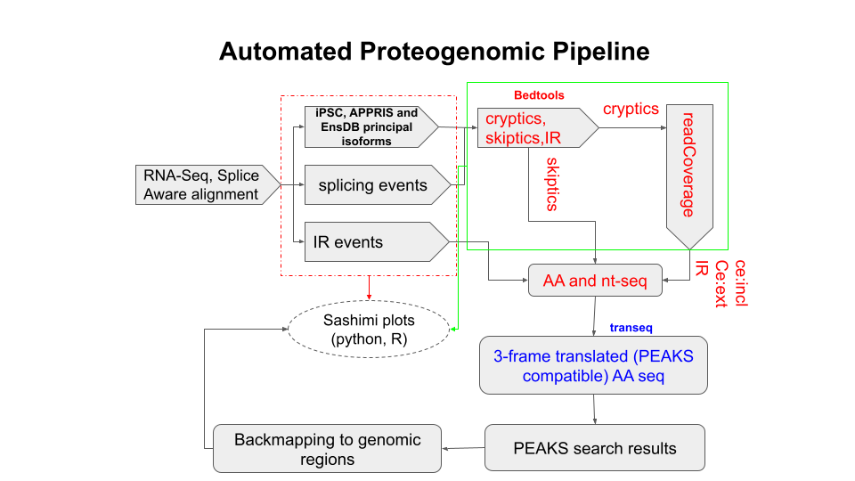

**General workflow of the Automated Proteogenomic Pipeline**.

This pipeline is comprised of **<font color='red'>3 parts: </font>**, Proteogenomic Pipeline (pgp)- A, Proteogenomic Pipeline (pgp)- B and Proteogenomic Pipeline (pgp)- C. **Part A** <font color='green'>generates sashimi plots (for all events), categorizes each event type and generates coverage bed files for all cryptic events </font>. It also generates a csv file for each of 
+ CE_inclusion 
+ CE_extension
+ IR
+ Exon_skip and
+ Annotated_junctions 

events for user verification (hand-curation) to be used as input for Part B of the pipeline. An All_events_sashimi.pdf (containing sashimi plots for all events) and a Summary_stats.txt file is also generated. 

**Part B** generates sashimi plots for all events in each of the hand-curated category and provides **<font color='green'>de novo</font>** amino acid (peptide) and nucleotide-sequences for each of these categories **(and generates a combined AA-seq fasta file of all event types for input to PEAKS search algorithm)**. 

Finally, **Part C** maps those **<font color='green'>de novo amino acid sequences which are also identified by mass spec</font>** onto sashimi plots. Below we describe each part of the pipeline.

#### Please note that each part of the pipeline is self contained (<font color='red'>run from its own folder</font>), so all scripts and required files should be copied in the respective folder for each part.

# Proteogenomic Pipeline (pgp)- A
Following Figure show the **workflow for part A**.
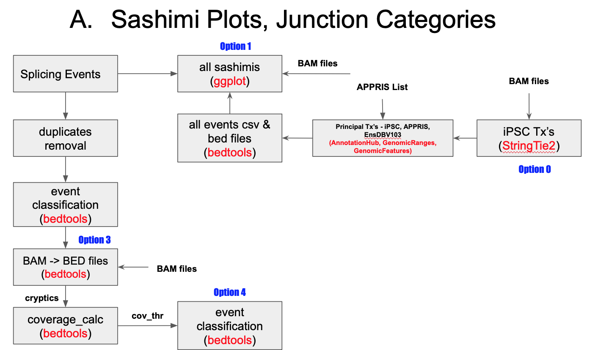
**Proteogenomic Pipeline Part A.** Various opttions (0-4) to run each segment of the pipeline are shown in blue. <br><br>Optionally, <font color='red'> **Option 5** can be used to run pipeline from start to finish </font>.

### Before you start
This pipeline has several dependencies (including R and several R libraries). Before running this notebook, it is **<font color='red'>recommended to activate the conda environment built with all required depencencies</font>**. <br> **Example: conda activate pgp_env** where **pgp_env is the conda environment that contains all dependencies**.

#### General Inputs
User must provide the following input files

<ul>
<li>All sample (control and knowk down (KD)) .bam and .bai files.</li>
<li>all_bams.tsv: A TAB separated file containing path to bam files for control and KD samples with following columns:</li>
    - col1: unique_sample name, col2: path to bam file and clo3: Any string (e.g Control, this is also used for Y-Lables for sashimi plots)
<li>Homo_sapiens.GRCh38.103.chr.sorted_new.gtf</li>
<li>gencode.v38.annotation.gtf</li>
<li>GRCh38.p13.genome.fa</li>
</ul>


**IMPORTANT:** Names of BAM file (in column 2 of all_bams.tsv files) **should follow UniqueSampleID.pass2Aligned.sortedByCoord.out.bam, where pipeline extracts UniqueSampleID for each file.**

###### Example:

**In the case of following 4 bam files**, JCM6188-1_S1.pass2Aligned.sortedByCoord.out.bam, JCM6188-2_S2.pass2Aligned.sortedByCoord.out.bam, JCM6188-8_S8.pass2Aligned.sortedByCoord.out.bam, JCM6188-9_S9.pass2Aligned.sortedByCoord.out.bam, <br> **pipeline will extract** JCM6188-1_S1, JCM6188-2_S2, JCM6188-8_S8 and JCM6188-9_S9 as four samples to work with.


#### PGP Scripts

<ul>
<li>part-a.sh (main script for Part A of the pipeline)</li>
<li>part-b.sh (main script for Part B of the pipeline)</li>   
<li>part-c.sh (main script for Part C of the pipeline)</li>
<li>esV5_layered_CDSV3.sh</li>
<li>abundant_tx.R (used to get abundant Txs from StringTie2 generated gtf files)</li>    
<li>TxEnsDB103_layeredV6.R (generates bed files for each splicing event)</li>
<li>Auto_CoverV4_layered_intronV3.R (used to identify coordinates of cryptic events)</li>
<li>check_aaV4_allFrames.R</li>
<li>get_orf_cds.R</li>
<li>pgp-c_gc_aa.sh</li>
<li>pgp-c_mappingV3.R</li>
</ul>   


#### Scripts and files needed for Part-A
<ul>
<li>part-a.sh (main script for Part A of the pipeline)</li>
<li>abundant_tx.R (used to get abundant Txs from StringTie2 generated gtf files)</li>    
<li>TxEnsDB103_layeredV6.R (generates bed files for each splicing event)</li>
<li>Auto_CoverV4_layered_intronV3.R (used to identify coordinates of cryptic events)</li>
</ul>

#### Sashimi scripts neede for part-A

<ul>
<li>run_sashimi.sh</li>
<li>ggsashimi_txV3.py</li>    
<li>palette.txt (color palette used with sashimi plots)</li>
</ul>


#### Tools for Part-A
<ul>
<li>StringTie2 for generating gtf files for KD samples to get abudant Txs (principal_tx.csv) for each event</li>
<li>samtools</li>    
<li>bedtools</li>        
</ul>

#### Splicing event file

Pipeline expects splicing events in a csv file (**no header line**) in the following format

| chromosome name | start | end | strand | gene_name | gene_id |
| - |  |  |  |  |  |
| chr10           | 101018324 | 101018822 |-| PDZD7     |ENSG00000186862.20|

## How to run
Some parts of this pipeline are **<font color='purple'> resource intensive </font>** and hence it can be run **step by step, Option 0-4** or as a **single: start-to-finish, Option 5** mode.

### Option 0: 
pgp follow **three layered approach** to determine potential Transcript for each splicing event in the following order.<br> 
<li>First, it tries to select princiap isoform as selected by the experiment under investigation and generates a list most abundant transcripts from gtf files generated by StringTie2 for all samples.</li> 
<li>Next, it select Principal Isofrom V1 from GRCh38_appris_data.principal.txt file.</li> 
<li>Lastly, it selects maximum number of Exons and largest size (in bp) from EnsDb.Hsapiens.v103.</li> <br> 

This part of the pipeline **expects all gtf files for KD samples in a folder called iPSC_gtfs** in current folder and **generates principal Transcripts list (principal_txs.csv file)** from these KD samples to be used in the next steps. 


**Requires: all *.bam* files and gencode.v38.annotation.gtf**. 
<br>**Scripts: pgp_a.sh**
<br>**Resources: 8 cores**

### Change directory to part-a of the pipeline


```python
%cd part-a
```

    /Users/syedshah/Documents/DTI_WORK/MichaelLab/proteogenomic_pipeline/github_final_pgp/final_newdata_phaseV4/part-a


```python
!nohup bash pgp-a.sh 0 > pgp-a-0.txt 2> pgp-a-0.error.txt
```

### Option 1:
Generates sashimi plots for all splicing events (**provided that principal_txs.csv file from option 0 already exists).** <br> **Input: events csv file (selected_events.csv)** <br> **Scripts: pgp_0.sh, run_sashimi.sh, ggsashimi_txV4.py and TxEnsDB103_layeredV5.R** 

**<font color="red">Please note that sashimi plots for all events are saved under folder all_events_sashimi as individual svg (which are then converted to pdf for convenience of copying coordinates to verify in IGV) file for each event as well as all_events_sashimi.pdf file containg all sashimi plots**</font>

**Importnat: In some cases creation of svg or its conversion to pdf file fails, we recommend using -F pdf (this will only generate pdf files) option in run_sashimi.sh script under such situations**

**Resources: RAM requirement for this step scales with number of samples (BAM files) included for sashimi plots. For our case of 18 samples totaling ~180GB, a machine with 120GB of RAM is recommended.**


```python
!nohup bash pgp-a.sh 1 selected_events.csv > pgp-a-1.txt 2> pgp-a-1.error.txt
```

### All events Sashimi Plots

An example sashimi plot (from all sashimi plots for the events given in selected_events.csv file) generated by the pipeline is shown in Figure below.
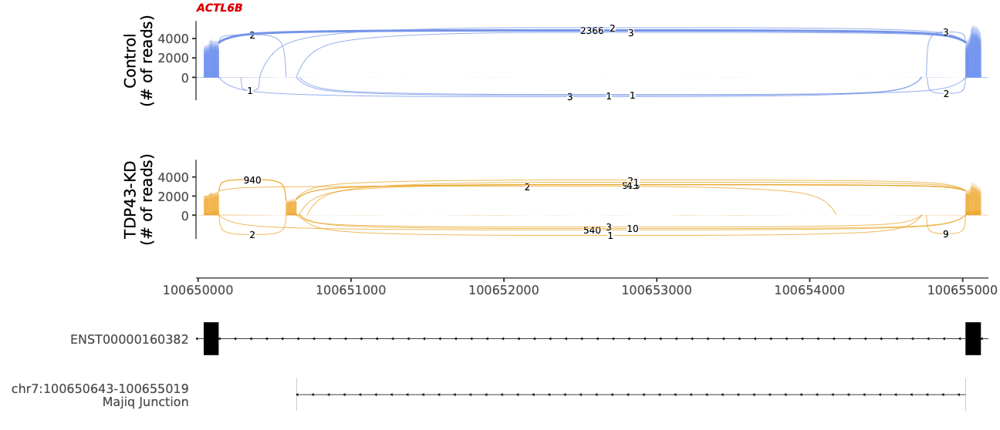
**Example sashimi plot 1. Read coverages for each sample are shown as layered graph (different shades) for Control (top panel) and KD samples (middle panel). Bottom panel (transcript lane) shows principal transcript in TDP-43 KD neurons and the coordinates of the mis-splicing event**

### Option 2:
This option allows user to run both option 0 and 1 in a **single step**.

**Resources: 8 cores. RAM requirement for this step scales with number of samples (BAM files) included for sashimi plots. For our case of 18 samples totaling ~180GB, a machine with 120GB of RAM is recommended.**


```python
!nohup bash pgp-a.sh 2 majiq_rbp.csv > pgp-a-2.txt 2> pgp-a-2.error.txt
```

### Option 3:
Creates bed files (**in folder bam_beds under current folder**) for all BAM files (**all .bam and .bai files for all samples exists**). <br>
**Scripts: pgp_0.sh**
**Resources: This is memory intensive step and we recommend ~ 120GB RAM**.


```python
!nohup bash pgp-a.sh 3 > pgp-a-3.txt 2> pgp-a-3.error.txt
```

### Option 4:
Creates cryptics list (**called non_skiptics_events.csv in current folder**), coverage files for all probable cryptics (**in folder coverages in current folder**) and final cryptics list (**IGV_unique_ce_extension.csv, IGV_unique_ce_inclusion.csv and IGV_unique_IR.csv**) for each category (**in folder res_ce_all under current folder**). <br>
**Scripts: pgp_0.sh, TxEnsDB103_layeredV5.R and Auto_CoverV4_layered_intronV3.R**


```python
!nohup bash pgp-a.sh 4 majiq_rbp.csv > pgp-a-4.txt 2> pgp-a-4.error.txt
```

## Run all steps from start to finish

###  Option 5:
From start to finish. i.e create iPSC Tx list, sashimi plots for all splicing events, clean splice events list, skiptics list, bed files for all BAM files, coverage files for all probable cryptics and final cryptics list for each category. 

**Scripts: pgp_0.sh, TxEnsDB103_layeredV6.R, Auto_CoverV4_layered_intronV3.R and run_sashimi.sh**

**<font color='red'>Did not run this option due to computational cost</font>**


```python
!bash pgp-a.sh 5 majiq_rbp.csv > pgp-a-5.txt 2> pgp-a-5.error.txt
```

# <div id="pgp-b" style="text-align: center;"> Proteogenomic Pipeline (pgp) - B </div> <br> <div style="text-align: center;"> (Hand-curated CE events) </div>

This part of the pipeline accepts **user modified list (for ce_inclusion, ce_extension and IR events)**  from Part-A of the pipeline and generates nt, AA fasta and events csv files for all event types. It processes hand curated ce events ce_inclusion_pgp1.csv and ce_extension_pgp1.csv and IR_pgp1.csv (based on list of ce events from part A, **please copy these files in folder part-b/ce_ext and part-c/ce_incl**) and applies variable coverage cutoff to **force all events in ce_inclusion_pgp1.csv to be ce_inclusion events** while ce_Extesnion and IR events are treated as as. **It also generates AA, nt and csv events files for skiptics events**

**Please note that this part of the pipeline will only work with those events whose coverage files are already calculcated from part-a (option 6)** <br> A general workflow of this part of the pipeline is shown in Figure 2.
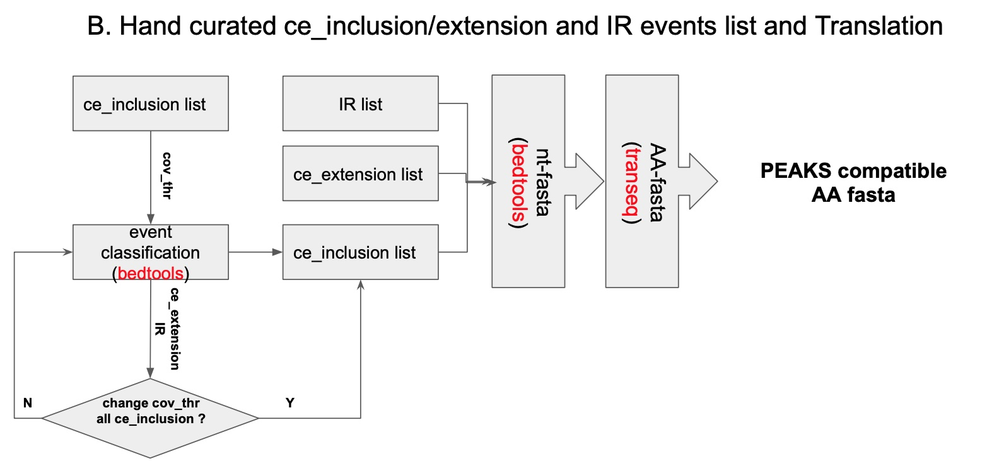
**Flowchart for Proteogenomic Pipeline Part B**.

#### Scripts and files needed for Part-B
<ul>
<li>part-b.sh (main script for Part B of the pipeline)</li>   
<li>esV5_layered_CDSV3.sh</li>
<li>TxEnsDB103_layeredV6.R (generates bed files for each splicing event)</li>
<li>run_sashimiV1.sh (generates sashimi plots for each event type)</li>
<li>palette.txt (color palette used with sashimi plots)</li>
<li>Auto_CoverV4_layered_intronV3.R (used to identify coordinates of cryptic events)</li>
<li>check_aaV4_allFrames.R</li>
<li>get_orf_cds.R</li>    
<li>palette.txt</li>    
<li>ggsashimi_txV3.py</li>   
</ul>   


**<font color='red'> Please note that each step in part-B also generates sashimi plots</font>**

This part of the pipeline processes:
<li> clean_combined_samples.csv for skiptic events </li>
<li> Hand curated ce_inclusion_pgp1.csv events (Iteratively by changing coverage_cutoff) </li>
<li> Hand curated ce_extension_pgp1.csv events </li>
<li> IR_pgp1.csv events </li>
<li> <font color='blue'> Merge AA, nt and csv files to generate PEAKS_AA.fasta (and various other) files for PEAKS search and downstream analysis</font></li>

**<font color='red'> Please change directory to part-b/es folder</font>**


```python
%cd ../part-b
```

    /Volumes/SYEDSHAH/MichaelLab/proteogenomic_pipeline/github_final_pgp/final_all_phasesV2/part-b


### Now generate AA, nt and csv event file for all skiptics events in clean_combined_samples.csv file


```python
!nohup bash pgp_b.sh majiq_rbp.csv > pgp_b_es.txt 2>pgp_b_es.error.txt
```

### Skiptic events Sashimi Plots

An example sashimi plot for an exon_skip event (from the list of all sashimi plots in selected_events.csv).
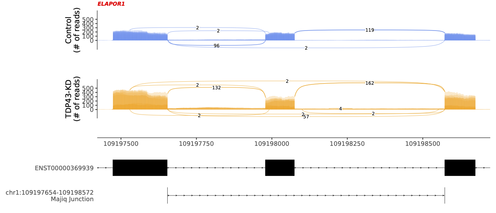
**Example sashimi plot for an exon-skip event. Read coverages for each sample is shown as layered graph (different shades) for control (top panel) and KD samples (moddle panel). Bottom panel (transcript lane) shows the coordinates identified by the proteogenomic pipeline, principal transcript selected in TDP-43 KD neuron and the coordinates of the mis-splicing event.**

### Now generate AA, nt and csv event files for all events in ce_inclusion_pgp1.csv <font color='red'> Iteratively </font>
**After running below script, please make sure to re-run it with remaining_events.csv file by adjusting cutoff value and num_events**


```python
cutoff1=0.6
!nohup bash pgp_b.sh ce_inclusion_pgp1.csv $cutoff1 1 > pgp_b_ce_"$cutoff1".txt 2>pgp_b_ce_"$cutoff1".error.txt
```


```python
!cp res_ce_"$cutoff1"/remaining_events.csv .
cutoff2=0.15
!bash pgp_b.sh remaining_events.csv $cutoff2 140 > pgp_b_ce_"$cutoff2".txt 2>pgp_b_ce_"$cutoff2".error.txt
```

## Cryptics Sashimi Plots
We classify cryptic events into **3 categories**. A mis-spliced event is categorized as **ce_inclusion** if both ends of the cryptic exon lie inside the intron (Figure below) while **ce_extension** is an event that is a continuation of an annotated exon ([Ce_Extension Events](#Ce_Extension-Events)). Lastly, **Intron retention (IR)** is identified by a continuous read between the intron.
### Ce_Inclusion Events
An example sashimi plot (from all ce_inclusion events in all_non_skiptics.csv list) is shown in Figure 4.
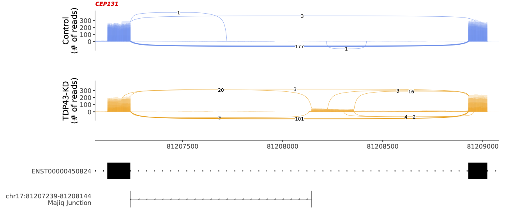
**Sashimi plot for ce_inclusion event. Read coverages for each sample is shown as layered graph (different shades) for control (top panel) and KD samples (moddle panel). Bottom panels (transcript lane) shows the principal transcript selected in TDP-43 KD neuron, the coordinates identified by the proteogenomic pipeline and the coordinates of the mis-splicing event.**

### Now generate AA, nt and csv event files for all events in ce_extension_pgp1.csv file

**Please make sure to use appropriate num_events (from previous steps) while running next step**


```python
!nohup bash pgp_b.sh ce_extension_pgp1.csv ext 200 > pgp_b_ce_ext.txt 2>pgp_b_ce_ext.error.txt
```

#### Ce_Extension Events
An example sashimi plot (from all ce_extension events in all_non_skiptics.csv list) is shown in the Figure below.
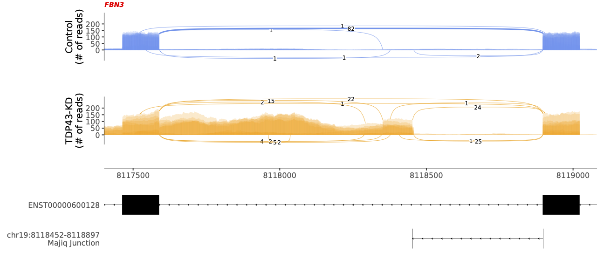
**Sashimi plot for ce_extension event. Read coverages for each sample is shown as layered graph (different shades) for control (top panel) and KD samples (moddle panel). Bottom panels (transcript lane) shows the principal transcript selected in TDP-43 KD neuron, the coordinates identified by the proteogenomic pipeline and the coordinates of the mis-splicing event.**

## Now generate AA, nt and csv event files for all events in  IR_pgp1.csv file


```python
%cd ../ce_ir
```

    /Volumes/SYEDSHAH/MichaelLab/proteogenomic_pipeline/github_final_pgp/final_all_phases/part-b/ce_ir


```python
!nohup bash pgp_b_ce_ir.sh IR_pgp1.csv > pgp_b_ce_ir.txt
```

## Merge AA, nt and csv files
Finally, merge AA, nt and csv files for each event type to use for PEAKS search.<br> 
**Step1:** Please CONCATENATE ce_inclusion (AA, nt and csv files) for each cutoff (used in part-b) using following code. 

STEP1: CONCATENATE ce_inclusion files generated by 40% FOLLOWED by 15% cut off
1. nt files (cds_ce_inclusion_fused.transeq_in.fasta etc) into cds_merged_nt_inclusion.fasta file
2. AA fasta files (cds_PEAKS_CE_INCLUSION_FUSED_AA.fasta) into cds_PEAKS_merged_aa_inclusion.fasta file
3. cds_IGV_unique_ce_inclusion.csv files from 40% and 15% cutoff to cds_merged_igv_inclusion.csv


**Please list all cutoff values** in cov_cutoff list below.


```python
%cd ../
```

    /Volumes/SYEDSHAH/MichaelLab/proteogenomic_pipeline/github_final_pgp/final_all_phases/part-b


#### First concatenate ce_inclusion files from all coverage_cutoff runs


```python
![ "$(ls -A temp/)" ] && rm temp/*.*
!mkdir -p temp
cov_cutoff = [.6,.15]
for i in cov_cutoff:
    folder='ce_incl/res_ce_'+str(i)
    !cat "$folder"/cds_ce_inclusion_fused.transeq_in.fasta >> temp/cds_merged_nt_inclusion.fasta
    !cat "$folder"/cds_PEAKS_CE_INCLUSION_FUSED_AA.fasta >> temp/cds_PEAKS_merged_aa_inclusion.fasta
    !cat "$folder"/cds_IGV_unique_ce_inclusion.csv >> temp/cds_merged_igv_inclusion.csv
    print(folder)
```

    ce_incl/res_ce_0.6
    ce_incl/res_ce_0.15


**Step2: NOW CONCATENATE** 

<li>cds_merged_nt_inclusion.fasta file and nt file (cds_ce_extension_fused.transeq_in.fasta) from extension events into cds_merged_nt_ce.fasta </li>
<li> cds_PEAKS_merged_aa_inclusion.fasta file and cds_PEAKS_CE_EXTENSION_FUSED_AA.fasta file from extension events into cds_PEAKS_aa_ce.fasta </li>
<li> cds_merged_igv_inclusion.csv file and cds_IGV_unique_ce_extension.csv file into cds_merged_igv_ce.csv </li>


```python
!cat temp/cds_merged_nt_inclusion.fasta ce_ext/res_ce_all/cds_ce_extension_fused.transeq_in.fasta >> temp/cds_merged_nt_ce.fasta
!cat temp/cds_PEAKS_merged_aa_inclusion.fasta ce_ext/res_ce_all/cds_PEAKS_CE_EXTENSION_FUSED_AA.fasta >> temp/cds_PEAKS_aa_ce.fasta
!cat temp/cds_merged_igv_inclusion.csv ce_ext/res_ce_all/cds_IGV_unique_ce_extension.csv >> temp/cds_merged_igv_ce.csv

```

**Step3: NOW CONCATENATE**
<li> cds_PEAKS_aa_ce.fasta, cds_PEAKS_SKIPTICS_FUSED_AA.fasta and FINAL_IR_AA.fasta files into PEAKS_AA.fasta </li> 
<li> IMPORTANT NOTE: We need individual merged_nt_ce.fasta, nt fasta file for SKIPTICS and IR events as well as merged_aa_ce.fasta, IR_AA.fasta files alongside respective csv files for proper backmapping on PEAKS search results. </li> 


```python
![ "$(ls -A PEAKS/)" ] && rm PEAKS/*.*
!mkdir -p PEAKS

!cat temp/cds_PEAKS_aa_ce.fasta es/res_skiptics/cds_PEAKS_SKIPTICS_FUSED_AA.fasta ce_ir/res_ce_all/FINAL_IR_AA.fasta > PEAKS/PEAKS_AA.fasta

!cp temp/cds_merged_nt_ce.fasta PEAKS/.

!cp temp/cds_merged_igv_ce.csv PEAKS/.

!cp es/res_skiptics/cds_PEAKS_SKIPTICS_FUSED_AA.fasta PEAKS/.

!cp es/res_skiptics/cds_IGV_unique_skiptics_translated.csv PEAKS/.

!cp es/res_skiptics/cds_skiptics_fused_transeq_in.fasta PEAKS/.

!cp ce_ir/res_ce_all/FINAL_IR_AA.fasta PEAKS/.

!cp ce_ir/res_ce_all/IGV_unique_IR.csv PEAKS/.

!cp ce_ir/res_ce_all/IR_coord_uniq_nt.transeq_in.fasta PEAKS/.

```


```python
%cd ../
```

    /Volumes/SYEDSHAH/MichaelLab/proteogenomic_pipeline/github_final_pgp/final_all_phases


# <div style="text-align: center;"> Proteogenomic Pipeline - C </div> <br><div style="text-align: center;"> (Mapping Peaks Results to event types) </div>
PEAKS search provides a list of peptides identified as probable biomarkers. In order to identify which genomic regions (from splicing events) these peptides had originated, we have developed a set of bash and R scripts. Overall **workflow for this part** of the pipeline is shown in Figure 3.
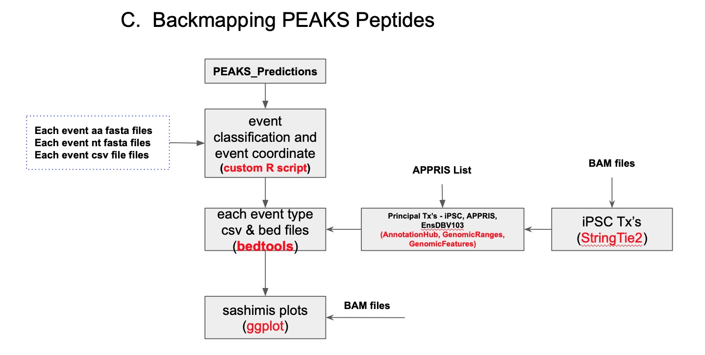
**Figure 3. Flowchart of Proteogenomic Pipeline Part C**.


#### Scripts needed for Part-C

<ul>
<li>pgp_c.sh (main script for Part C of the pipeline)</li>
<li>pgp-c_mappingV3.R</li>
<li>palette.txt</li>
<li>TxEnsDB103_layeredV6.R</li>
<li>ggsashimi_txV3.py</li>    
<li>run_sashimiV1.sh</li>
</ul>   


## Backmapping

**Dependencies:** Please copy following files into a folder called **inputs** inside folder part-c
<li> PEAKS output csv file (please note that col1-2 should be "Peptide" and "Accession" colums) </li>
<li> PEAKS_AA.fasta (output of pgp AA fasta file that was used as input for PEAKS search)</li> 
<li> Files cds_merged_igv_ce.csv, cds_merged_nt_ce.fasta, AllFrames_PEAKS_SKIPTICS_FUSED_AA.fasta, cds_IGV_unique_skiptics_translated.csv, cds_skiptics_fused_transeq_in.fasta, FINAL_IR_AA.fasta, IGV_unique_IR.csv and IR_coord_uniq_nt.transeq_in.fasta </li>
<li> GRCh38_appris_data.principal.txt, Homo_sapiens.GRCh38.103.chr.sorted_new.gtf </li>
<li> all_bams.tsv </li>


```python
%cd part-c
```

    /Volumes/SYEDSHAH/MichaelLab/proteogenomic_pipeline/github_final_pgp/final_all_phasesV3/part-c


```python
!nohup bash pgp_c.sh > pgp_c.txt 2>pgp_c.error.txt
```

#### Backmapped Events Examples
Example sashimi plots showing events mapped to up/downstream exon, up and downstream exon and ce region of the skiptic and cryptic events.

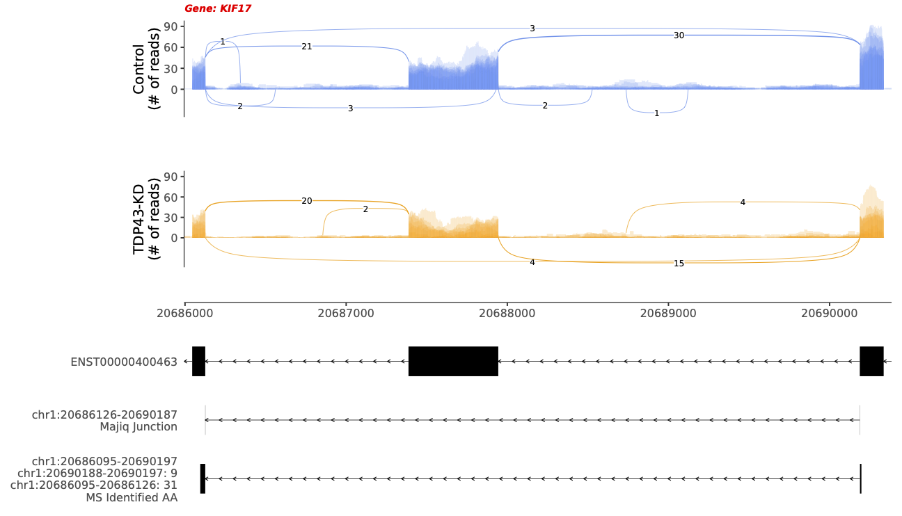

**Sashimi plot showing PEAKS identified peptide in the up and downstream exons of an Exon Skip event**

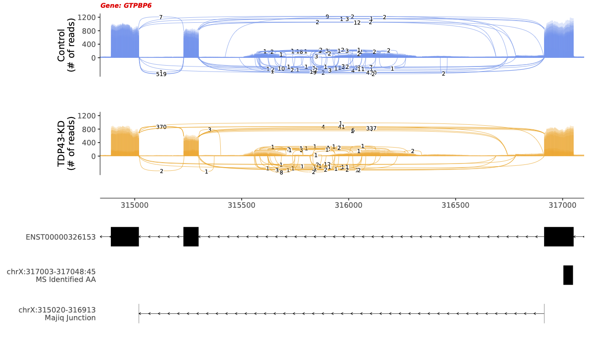

**Sashimi plot showing PEAKS identified peptide in the upstream exon of an Exon Skip event**


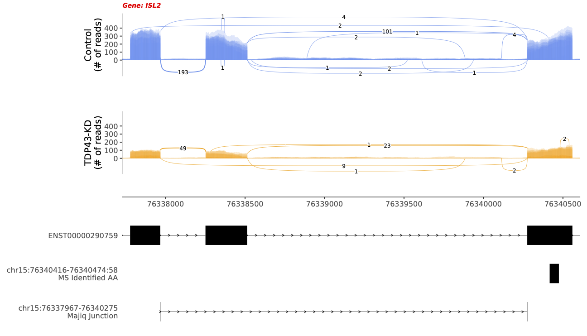

**Sashimi plot showing PEAKS identified peptide in the downstream exon of an Exon Skip event**

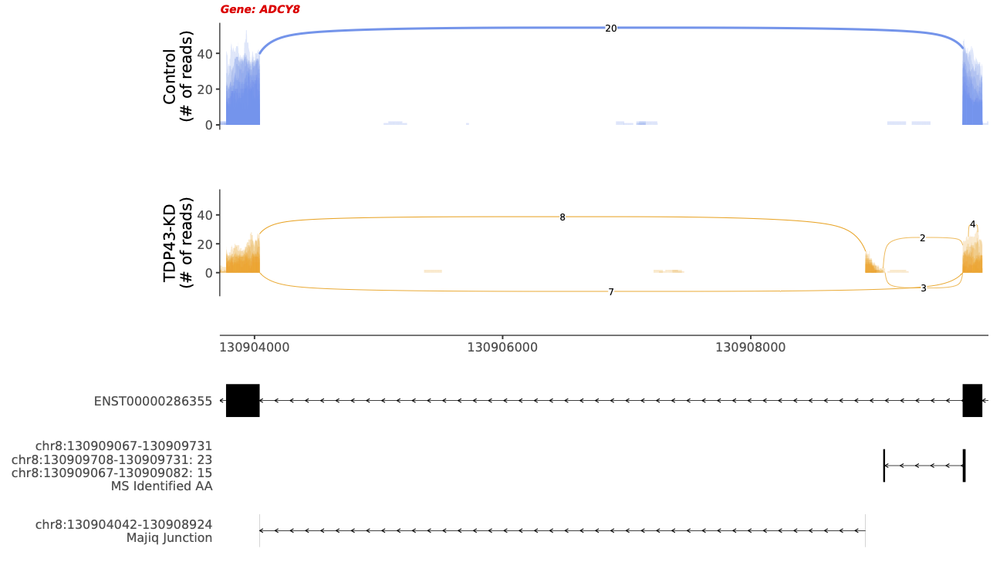

**Sashimi plot showing PEAKS identified peptide in the cryptic and upstream exons of a cryptic event**

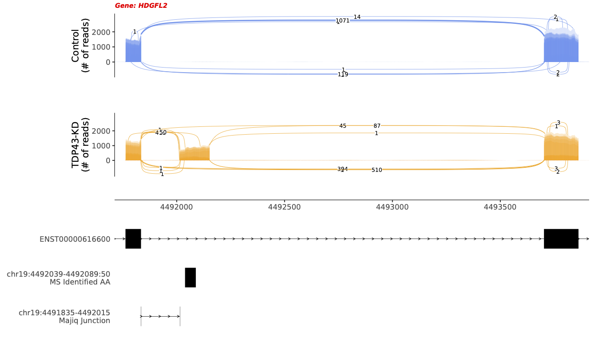

**Sashimi plot showing PEAKS identified peptide in the cryptic exon of a cryptic event**

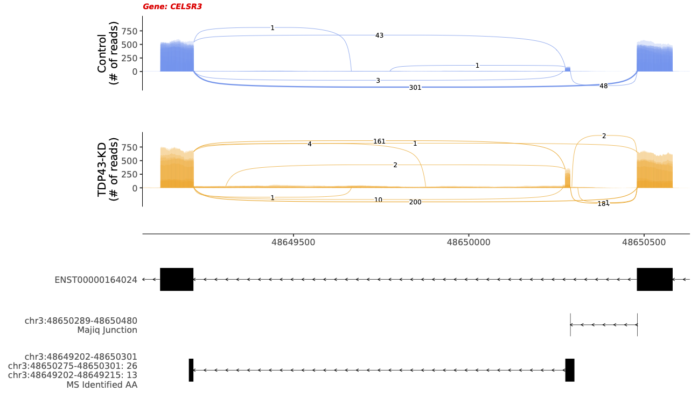
**Sashimi plot showing PEAKS identified peptide in the cryptic and downstream exon of a cryptic event**

## Tools/Packages used
R Tools: GenomicFeatures, GenomicRanges, EnsDb.Hsapiens.v103 
General Tools: StringTie2, Bedtools, EMBOSS, Samtools 

## Compute Requirements
We tested this pipeline on MAC and Linux OS. On a MAC with 16GB of RAM and quadcore processor, a data set comprising of 16 control and 9 KD samples (total -- GB data set) and an event list of 30, takes **~** hours to complete.

## Convert to html file


```python
#%cd ../
!jupyter nbconvert --to html pgpV_newdata.ipynb
```

    [NbConvertApp] Converting notebook pgpV_newdata.ipynb to html
    [NbConvertApp] Writing 636871 bytes to pgpV_newdata.html


```python

```
