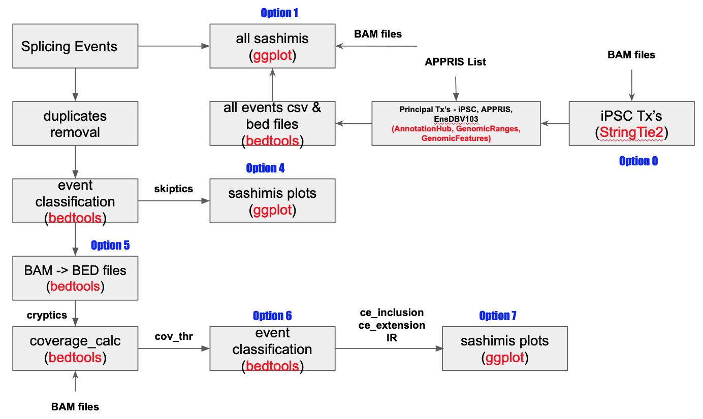

# Proteogenomic Pipeline (pgp)- A
The proteogenomici pipeline identifies **de novo** peptide sequences from a set of user-provided mis-spliced junction coordinates. This pipeline comprises **3 parts:** Part A (the focus of this readme) visualizes and categorizes each splice junction, Part B provides **de novo** peptide sequences, and Part C maps mass spec identified amini acid sequences onto sashimi plots from part B. The **workflow for part A is show in Figure 1.**

**Figure 1. Proteogenomic Pipeline Part A. Various opttions (0-7) to run each segment of the pipeline are shown in blue. <font color='red'>Option 8 pipeline from start to finish</font>.**

#### General Inputs
User must provide the following

<ul>
<li>All knock down (KD) .bam and .bai files.</li>
<li>Homo_sapiens.GRCh38.103.chr.sorted_new.gtf</li>
<li>gencode.v38.annotation.gtf</li>
<li>GRCh38.p13.genome.fa</li>
</ul>

**IMPORTANT: Names of BAM file should follow UniqueSampleID.pass2Aligned.sortedByCoord.out.bam, where pipeline extracts UniqueSampleID for each file.**

###### Example:

In the case of following 4 bam files, JCM6188-1_S1.pass2Aligned.sortedByCoord.out.bam and JCM6188-2_S2.pass2Aligned.sortedByCoord.out.bam, JCM6188-8_S8.pass2Aligned.sortedByCoord.out.bam, JCM6188-9_S9.pass2Aligned.sortedByCoord.out.bam, pipeline will extract JCM6188-1_S1, JCM6188-2_S2, JCM6188-8_S8 and JCM6188-9_S9 as four samples to work with.


#### Scripts

<ul>
<li>pgp_0.sh (main script)</li>
<li>abundant_tx.R (used to get abundant Txs from BAM files using StringTie2)</li>    
<li>TxEnsDB103_layeredV5.R (generates bed files for each splicing event)</li>
<li>run_sashimi.sh (generates sashimi plots for each event type)</li>
<li>all_bams.tsv (tab separated file containing path to bam files for control and KD samples)</li>
<li>palette.txt (color palette used with sashimi plots)</li>
<li>Auto_CoverV4_layered_intronV2.R (used to identify coordinates of cryptic events)</li>
</ul>   

    
#### Splicing event file

Pipeline expects splicing events in a csv file (**no header line**) in the following format

| chromosome name | start | end | strand | gene_name | gene_id |
| --------------- | ----- | --- | ------ | --------- | ------- |
| chr10           | 101018324 | 101018822 |-| PDZD7     |ENSG00000186862.20|


```python

```

## How to run
Some parts of this pipeline are resource intensive and hence it can be run **step by step** or as a **single: start-to-finish** mode.

**Option 0:** Only generates principal Transcripts list from KD samples. *Requires all .bam files and gencode.v38.annotation.gtf*. **Scripts: pgp_a.sh**


```python
!bash pgp_a.sh 0
```

    STARTED SringTie Calculations - Will take a while depending on number of samples
    STARTED PROCESSING SAMPLE JCM6188-8_S8
    STARTED PROCESSING SAMPLE JCM6188-9_S9
    STARTED PROCESSING SAMPLE JCM6188-10_S10
    STARTED PROCESSING SAMPLE JCM6188-11_S11
    STARTED PROCESSING SAMPLE JCM6188-12_S12
    DONE WITH SringTie Calculations - NOW GENERATING LIST of ABUNDANT Txs
    PROCESSING SAMPLE iPSC_gtfs/JCM6188-10_S10.gtf
    PROCESSING SAMPLE iPSC_gtfs/JCM6188-11_S11.gtf
    PROCESSING SAMPLE iPSC_gtfs/JCM6188-12_S12.gtf
    PROCESSING SAMPLE iPSC_gtfs/JCM6188-1_S1.gtf
    PROCESSING SAMPLE iPSC_gtfs/JCM6188-2_S2.gtf
    PROCESSING SAMPLE iPSC_gtfs/JCM6188-8_S8.gtf
    PROCESSING SAMPLE iPSC_gtfs/JCM6188-9_S9.gtf
    Loading required package: readxl
    Loading required package: tidyverse
    ── [1mAttaching packages[22m ─────────────────────────────────────── tidyverse 1.3.1 ──
    [32m✔[39m [34mggplot2[39m 3.3.5     [32m✔[39m [34mpurrr  [39m 0.3.4
    [32m✔[39m [34mtibble [39m 3.1.6     [32m✔[39m [34mdplyr  [39m 1.0.8
    [32m✔[39m [34mtidyr  [39m 1.2.0     [32m✔[39m [34mstringr[39m 1.4.0
    [32m✔[39m [34mreadr  [39m 2.1.2     [32m✔[39m [34mforcats[39m 0.5.1
    ── [1mConflicts[22m ────────────────────────────────────────── tidyverse_conflicts() ──
    [31m✖[39m [34mdplyr[39m::[32mfilter()[39m masks [34mstats[39m::filter()
    [31m✖[39m [34mdplyr[39m::[32mlag()[39m    masks [34mstats[39m::lag()
    [?25h[?25h[?25h[?25h[?25h[1] "reading file: JCM6188-1_S1.csv"
    [1] "reading file: JCM6188-10_S10.csv"
    [1] "reading file: JCM6188-11_S11.csv"
    [1] "reading file: JCM6188-12_S12.csv"
    [1] "reading file: JCM6188-2_S2.csv"
    [1] "reading file: JCM6188-8_S8.csv"
    [1] "reading file: JCM6188-9_S9.csv"
    [?25h[?25h[?25h[?25h[?25h[1] "Now Generating Txs Table, Will take a while !!!!!!!"
    [?25h[?25h[?25h[?25h[?25h[1] "Done With Txs Table: principal_txs.csv"
    [?25h[?25hDONE WITH ABUNDANT Txs Generation for input BAM SAMPLES
    For final statistics on ce events, please see res_ce_all/CE_all_FINAL_STATS.txt file
    ALL DONE - hopefully - Successfully


**Option 1:** Generates sashimi plots for all splicing events (provided that Txs list (**from option 0**) already exists). **Scripts: pgp_0.sh, run_sashimi.sh and TxEnsDB103_layeredV5.R**


```python
!bash pgp_0.sh 1 selected_events.csv
```

    CAME IN FOR SASHIMI PLOTS FOR ALL EVENTS
    ################################ GENERATING BED FILE FOR SASHIMI PLOTS FOR ALL EVENTS
    Loading required package: stats4
    Loading required package: BiocGenerics
    Loading required package: parallel
    
    Attaching package: ‘BiocGenerics’
    
    The following objects are masked from ‘package:parallel’:
    
        clusterApply, clusterApplyLB, clusterCall, clusterEvalQ,
        clusterExport, clusterMap, parApply, parCapply, parLapply,
        parLapplyLB, parRapply, parSapply, parSapplyLB
    
    The following objects are masked from ‘package:stats’:
    
        IQR, mad, sd, var, xtabs
    
    The following objects are masked from ‘package:base’:
    
        anyDuplicated, append, as.data.frame, basename, cbind, colnames,
        dirname, do.call, duplicated, eval, evalq, Filter, Find, get, grep,
        grepl, intersect, is.unsorted, lapply, Map, mapply, match, mget,
        order, paste, pmax, pmax.int, pmin, pmin.int, Position, rank,
        rbind, Reduce, rownames, sapply, setdiff, sort, table, tapply,
        union, unique, unsplit, which.max, which.min
    
    Loading required package: S4Vectors
    
    Attaching package: ‘S4Vectors’
    
    The following object is masked from ‘package:base’:
    
        expand.grid
    
    Loading required package: IRanges
    Loading required package: GenomeInfoDb
    Loading required package: BiocFileCache
    Loading required package: dbplyr
    [?25hLoading required package: AnnotationDbi
    Loading required package: Biobase
    Welcome to Bioconductor
    
        Vignettes contain introductory material; view with
        'browseVignettes()'. To cite Bioconductor, see
        'citation("Biobase")', and for packages 'citation("pkgname")'.
    
    
    Attaching package: ‘Biobase’
    
    The following object is masked from ‘package:AnnotationHub’:
    
        cache
    
    [?25h[?25hLoading required package: AnnotationFilter
    
    Attaching package: 'ensembldb'
    
    The following object is masked from 'package:stats':
    
        filter
    
    [?25hsnapshotDate(): 2020-10-27
    [?25hloading from cache
    [?25h[?25h[?25h[?25h[?25h[1] "Started Generating BED files for Splicing Events in folder event_bedfiles/ from File: sorted_selected_events.csv"
    [?25h[?25h[?25h[?25h[?25h[?25h[?25h[?25h[?25h[?25h[?25h[?25h[?25h[?25h[?25h[?25h[?25h[1] "Out of a total of:  31  Events: Transcripts for:  0  Events are not_found are"
    [?25h[1] "Total :  28  iPSC Princiapl Tx are selected"
    [?25h[1] "Total :  1  APPRIS Principal Tx are selected"
    [?25h[1] "Total :  2  EnsDB Princiapl Tx (maximum number of Exons and largest size (in bp)) are selected"
    [?25h[1] "Out of Total :  31  A total of:  31  Events have Valid Transcripts (event lies between Transcript ends) and  0  Events have Transcripts that does not Encapsulate events"
    [?25h[?25hbed_data chr5 115841935 115842106 172 1 +
    exon 3 bed_ln chr5 115895087 115895158 72 4 +
    ################################ DONE 
    ################################ STARTED CREATING SASHIMI PLOTS FOR ALL EVENTS - MAY TAKE MANY HOURS 
    read 31 records
    processing event num 1 event AARS1-chr16-70272882-70276486-1 and majiq event is chr16-70272882-70276486
    [W::hts_idx_load3] The index file is older than the data file: ../all_bams/kd/JCM6188-8_S8.pass2Aligned.sortedByCoord.out.bam.bai
    I have Tx: ENST00000261772
    finally got chr: "AARS1" start: 70271731 end: 70276681
    ['70272882', '70276486']
    [?25h[?25h[?25h[?25h[?25h[?25h[?25h[?25h[?25h[?25h[?25h[?25h[?25h[?25h[?25h[?25h[?25h[?25h[?25h[?25h[?25h[?25h[?25h[?25h[?25h[?25h[?25h[?25h[?25h[?25h[?25h[?25h[?25h[?25h[?25h[?25h[?25h[?25h[?25h[?25h[?25h[?25h[?25h[?25h[?25h[?25h[?25h[?25hprocessing event num 2 event AARS1-chr16-70271972-70272796-2 and majiq event is chr16-70271972-70272796
    [W::hts_idx_load3] The index file is older than the data file: ../all_bams/kd/JCM6188-8_S8.pass2Aligned.sortedByCoord.out.bam.bai
    I have Tx: ENST00000261772
    finally got chr: "AARS1" start: 70271731 end: 70276681
    ['70271972', '70272796']
    [?25h[?25h[?25h[?25h[?25h[?25h[?25h[?25h[?25h[?25h[?25h[?25h[?25h[?25h[?25h[?25h[?25h[?25h[?25h[?25h[?25h[?25h[?25h[?25h[?25h[?25h[?25h[?25h[?25h[?25h[?25h[?25h[?25h[?25h[?25h[?25h[?25h[?25h[?25h[?25h[?25h[?25h[?25h[?25h[?25h[?25h[?25h[?25hprocessing event num 3 event ABLIM1-chr10-114448020-114451624-1 and majiq event is chr10-114448020-114451624
    [W::hts_idx_load3] The index file is older than the data file: ../all_bams/kd/JCM6188-8_S8.pass2Aligned.sortedByCoord.out.bam.bai
    I have Tx: ENST00000369253
    finally got chr: "ABLIM1" start: 114447830 end: 114451721
    ['114448020', '114451624']
    [?25h[?25h[?25h[?25h[?25h[?25h[?25h[?25h[?25h[?25h[?25h[?25h[?25h[?25h[?25h[?25h[?25h[?25h[?25h[?25h[?25h[?25h[?25h[?25h[?25h[?25h[?25h[?25h[?25h[?25h[?25h[?25h[?25h[?25h[?25h[?25h[?25h[?25h[?25h[?25h[?25h[?25h[?25h[?25h[?25h[?25h[?25h[?25hprocessing event num 4 event AC007383.3-chr2-206084748-206085957-1 and majiq event is chr2-206084748-206085957
    [W::hts_idx_load3] The index file is older than the data file: ../all_bams/kd/JCM6188-8_S8.pass2Aligned.sortedByCoord.out.bam.bai
    I have Tx: ENST00000420509
    finally got chr: "AC007383.1" start: 206084555 end: 206086614
    ['206084748', '206085957']
    [?25h[?25h[?25h[?25h[?25h[?25h[?25h[?25h[?25h[?25h[?25h[?25h[?25h[?25h[?25h[?25h[?25h[?25h[?25h[?25h[?25h[?25h[?25h[?25h[?25h[?25h[?25h[?25h[?25h[?25h[?25h[?25h[?25h[?25h[?25h[?25h[?25h[?25h[?25h[?25h[?25h[?25h[?25h[?25h[?25h[?25h[?25h[?25hprocessing event num 5 event ACBD3-chr1-226156780-226159184-1 and majiq event is chr1-226156780-226159184
    [W::hts_idx_load3] The index file is older than the data file: ../all_bams/kd/JCM6188-8_S8.pass2Aligned.sortedByCoord.out.bam.bai
    I have Tx: ENST00000366812
    finally got chr: "ACBD3" start: 226154597 end: 226159408
    ['226156780', '226159184']
    [?25h[?25h[?25h[?25h[?25h[?25h[?25h[?25h[?25h[?25h[?25h[?25h[?25h[?25h[?25h[?25h[?25h[?25h[?25h[?25h[?25h[?25h[?25h[?25h[?25h[?25h[?25h[?25h[?25h[?25h[?25h[?25h[?25h[?25h[?25h[?25h[?25h[?25h[?25h[?25h[?25h[?25h[?25h[?25h[?25h[?25h[?25h[?25hprocessing event num 6 event ACTL6B-chr7-100650643-100655019-1 and majiq event is chr7-100650643-100655019
    [W::hts_idx_load3] The index file is older than the data file: ../all_bams/kd/JCM6188-8_S8.pass2Aligned.sortedByCoord.out.bam.bai
    I have Tx: ENST00000160382
    finally got chr: "ACTL6B" start: 100649988 end: 100655169
    ['100650643', '100655019']
    [?25h[?25h[?25h[?25h[?25h[?25h[?25h[?25h[?25h[?25h[?25h[?25h[?25h[?25h[?25h[?25h[?25h[?25h[?25h[?25h[?25h[?25h[?25h[?25h[?25h[?25h[?25h[?25h[?25h[?25h[?25h[?25h[?25h[?25h[?25h[?25h[?25h[?25h[?25h[?25h[?25h[?25h[?25h[?25h[?25h[?25h[?25h[?25hprocessing event num 7 event ACTL6B-chr7-100650135-100650575-2 and majiq event is chr7-100650135-100650575
    [W::hts_idx_load3] The index file is older than the data file: ../all_bams/kd/JCM6188-8_S8.pass2Aligned.sortedByCoord.out.bam.bai
    I have Tx: ENST00000160382
    finally got chr: "ACTL6B" start: 100649988 end: 100655169
    ['100650135', '100650575']
    [?25h[?25h[?25h[?25h[?25h[?25h[?25h[?25h[?25h[?25h[?25h[?25h[?25h[?25h[?25h[?25h[?25h[?25h[?25h[?25h[?25h[?25h[?25h[?25h[?25h[?25h[?25h[?25h[?25h[?25h[?25h[?25h[?25h[?25h[?25h[?25h[?25h[?25h[?25h[?25h[?25h[?25h[?25h[?25h[?25h[?25h[?25h[?25hprocessing event num 8 event ADCY8-chr8-130909066-130909708-1 and majiq event is chr8-130909066-130909708
    [W::hts_idx_load3] The index file is older than the data file: ../all_bams/kd/JCM6188-8_S8.pass2Aligned.sortedByCoord.out.bam.bai
    I have Tx: ENST00000286355
    finally got chr: "ADCY8" start: 130903722 end: 130909916
    ['130909066', '130909708']
    [?25h[?25h[?25h[?25h[?25h[?25h[?25h[?25h[?25h[?25h[?25h[?25h[?25h[?25h[?25h[?25h[?25h[?25h[?25h[?25h[?25h[?25h[?25h[?25h[?25h[?25h[?25h[?25h[?25h[?25h[?25h[?25h[?25h[?25h[?25h[?25h[?25h[?25h[?25h[?25h[?25h[?25h[?25h[?25h[?25h[?25h[?25h[?25hprocessing event num 9 event ADCY8-chr8-130904042-130908924-2 and majiq event is chr8-130904042-130908924
    [W::hts_idx_load3] The index file is older than the data file: ../all_bams/kd/JCM6188-8_S8.pass2Aligned.sortedByCoord.out.bam.bai
    I have Tx: ENST00000286355
    finally got chr: "ADCY8" start: 130903722 end: 130909916
    ['130904042', '130908924']
    [?25h[?25h[?25h[?25h[?25h[?25h[?25h[?25h[?25h[?25h[?25h[?25h[?25h[?25h[?25h[?25h[?25h[?25h[?25h[?25h[?25h[?25h[?25h[?25h[?25h[?25h[?25h[?25h[?25h[?25h[?25h[?25h[?25h[?25h[?25h[?25h[?25h[?25h[?25h[?25h[?25h[?25h[?25h[?25h[?25h[?25h[?25h[?25hprocessing event num 10 event AGPAT4-chr6-161153499-161166248-1 and majiq event is chr6-161153499-161166248
    [W::hts_idx_load3] The index file is older than the data file: ../all_bams/kd/JCM6188-8_S8.pass2Aligned.sortedByCoord.out.bam.bai
    I have Tx: ENST00000320285
    finally got chr: "AGPAT4" start: 161153296 end: 161166467
    ['161153499', '161166248']
    [?25h[?25h[?25h[?25h[?25h[?25h[?25h[?25h[?25h[?25h[?25h[?25h[?25h[?25h[?25h[?25h[?25h[?25h[?25h[?25h[?25h[?25h[?25h[?25h[?25h[?25h[?25h[?25h[?25h[?25h[?25h[?25h[?25h[?25h[?25h[?25h[?25h[?25h[?25h[?25h[?25h[?25h[?25h[?25h[?25h[?25h[?25h[?25hprocessing event num 11 event AKAP6-chr14-32599506-32600626-1 and majiq event is chr14-32599506-32600626
    [W::hts_idx_load3] The index file is older than the data file: ../all_bams/kd/JCM6188-8_S8.pass2Aligned.sortedByCoord.out.bam.bai
    I have Tx: ENST00000280979
    finally got chr: "AKAP6" start: 32599360 end: 32600842
    ['32599506', '32600626']
    [?25h[?25h[?25h[?25h[?25h[?25h[?25h[?25h[?25h[?25h[?25h[?25h[?25h[?25h[?25h[?25h[?25h[?25h[?25h[?25h[?25h[?25h[?25h[?25h[?25h[?25h[?25h[?25h[?25h[?25h[?25h[?25h[?25h[?25h[?25h[?25h[?25h[?25h[?25h[?25h[?25h[?25h[?25h[?25h[?25h[?25h[?25h[?25hprocessing event num 12 event ANKEF1-chr20-10035333-10035579-1 and majiq event is chr20-10035333-10035579
    [W::hts_idx_load3] The index file is older than the data file: ../all_bams/kd/JCM6188-8_S8.pass2Aligned.sortedByCoord.out.bam.bai
    I have Tx: ENST00000378380
    finally got chr: "ANKEF1" start: 10034999 end: 10038697
    ['10035333', '10035579']
    [?25h[?25h[?25h[?25h[?25h[?25h[?25h[?25h[?25h[?25h[?25h[?25h[?25h[?25h[?25h[?25h[?25h[?25h[?25h[?25h[?25h[?25h[?25h[?25h[?25h[?25h[?25h[?25h[?25h[?25h[?25h[?25h[?25h[?25h[?25h[?25h[?25h[?25h[?25h[?25h[?25h[?25h[?25h[?25h[?25h[?25h[?25h[?25hprocessing event num 13 event ANKRD16-chr10-5888241-5889041-1 and majiq event is chr10-5888241-5889041
    [W::hts_idx_load3] The index file is older than the data file: ../all_bams/kd/JCM6188-8_S8.pass2Aligned.sortedByCoord.out.bam.bai
    I have Tx: ENST00000380092
    finally got chr: "ANKRD16" start: 5887797 end: 5889921
    ['5888241', '5889041']
    [?25h[?25h[?25h[?25h[?25h[?25h[?25h[?25h[?25h[?25h[?25h[?25h[?25h[?25h[?25h[?25h[?25h[?25h[?25h[?25h[?25h[?25h[?25h[?25h[?25h[?25h[?25h[?25h[?25h[?25h[?25h[?25h[?25h[?25h[?25h[?25h[?25h[?25h[?25h[?25h[?25h[?25h[?25h[?25h[?25h[?25h[?25h[?25hprocessing event num 14 event AP3S1-chr5-115866761-115895087-1 and majiq event is chr5-115866761-115895087
    [W::hts_idx_load3] The index file is older than the data file: ../all_bams/kd/JCM6188-8_S8.pass2Aligned.sortedByCoord.out.bam.bai
    I have Tx: ENST00000316788
    finally got chr: "AP3S1" start: 115866620 end: 115895208
    ['115866761', '115895087']
    [?25h[?25h[?25h[?25h[?25h[?25h[?25h[?25h[?25h[?25h[?25h[?25h[?25h[?25h[?25h[?25h[?25h[?25h[?25h[?25h[?25h[?25h[?25h[?25h[?25h[?25h[?25h[?25h[?25h[?25h[?25h[?25h[?25h[?25h[?25h[?25h[?25h[?25h[?25h[?25h[?25h[?25h[?25h[?25h[?25h[?25h[?25h[?25hprocessing event num 15 event ARFGAP3-chr22-42808890-42817142-1 and majiq event is chr22-42808890-42817142
    [W::hts_idx_load3] The index file is older than the data file: ../all_bams/kd/JCM6188-8_S8.pass2Aligned.sortedByCoord.out.bam.bai
    I have Tx: ENST00000263245
    finally got chr: "ARFGAP3" start: 42808717 end: 42817314
    ['42808890', '42817142']
    [?25h[?25h[?25h[?25h[?25h[?25h[?25h[?25h[?25h[?25h[?25h[?25h[?25h[?25h[?25h[?25h[?25h[?25h[?25h[?25h[?25h[?25h[?25h[?25h[?25h[?25h[?25h[?25h[?25h[?25h[?25h[?25h[?25h[?25h[?25h[?25h[?25h[?25h[?25h[?25h[?25h[?25h[?25h[?25h[?25h[?25h[?25h[?25hprocessing event num 16 event ARHGAP22-chr10-48555550-48604763-1 and majiq event is chr10-48555550-48604763
    [W::hts_idx_load3] The index file is older than the data file: ../all_bams/kd/JCM6188-8_S8.pass2Aligned.sortedByCoord.out.bam.bai
    I have Tx: ENST00000249601
    finally got chr: "ARHGAP22" start: 48555413 end: 48605123
    ['48555550', '48604763']
    [?25h[?25h[?25h[?25h[?25h[?25h[?25h[?25h[?25h[?25h[?25h[?25h[?25h[?25h[?25h[?25h[?25h[?25h[?25h[?25h[?25h[?25h[?25h[?25h[?25h[?25h[?25h[?25h[?25h[?25h[?25h[?25h[?25h[?25h[?25h[?25h[?25h[?25h[?25h[?25h[?25h[?25h[?25h[?25h[?25h[?25h[?25h[?25hprocessing event num 17 event ARHGAP22-chr10-48555550-48604763-2 and majiq event is chr10-48555550-48604763
    [W::hts_idx_load3] The index file is older than the data file: ../all_bams/kd/JCM6188-8_S8.pass2Aligned.sortedByCoord.out.bam.bai
    I have Tx: ENST00000249601
    finally got chr: "ARHGAP22" start: 48555413 end: 48605123
    ['48555550', '48604763']
    [?25h[?25h[?25h[?25h[?25h[?25h[?25h[?25h[?25h[?25h[?25h[?25h[?25h[?25h[?25h[?25h[?25h[?25h[?25h[?25h[?25h[?25h[?25h[?25h[?25h[?25h[?25h[?25h[?25h[?25h[?25h[?25h[?25h[?25h[?25h[?25h[?25h[?25h[?25h[?25h[?25h[?25h[?25h[?25h[?25h[?25h[?25h[?25hprocessing event num 18 event ARHGAP22-chr10-48583510-48604763-3 and majiq event is chr10-48583510-48604763
    [W::hts_idx_load3] The index file is older than the data file: ../all_bams/kd/JCM6188-8_S8.pass2Aligned.sortedByCoord.out.bam.bai
    I have Tx: ENST00000249601
    finally got chr: "ARHGAP22" start: 48582903 end: 48605123
    ['48583510', '48604763']
    [?25h[?25h[?25h[?25h[?25h[?25h[?25h[?25h[?25h[?25h[?25h[?25h[?25h[?25h[?25h[?25h[?25h[?25h[?25h[?25h[?25h[?25h[?25h[?25h[?25h[?25h[?25h[?25h[?25h[?25h[?25h[?25h[?25h[?25h[?25h[?25h[?25h[?25h[?25h[?25h[?25h[?25h[?25h[?25h[?25h[?25h[?25h[?25hprocessing event num 19 event ARHGAP22-chr10-48583510-48604763-4 and majiq event is chr10-48583510-48604763
    [W::hts_idx_load3] The index file is older than the data file: ../all_bams/kd/JCM6188-8_S8.pass2Aligned.sortedByCoord.out.bam.bai
    I have Tx: ENST00000249601
    finally got chr: "ARHGAP22" start: 48582903 end: 48605123
    ['48583510', '48604763']
    [?25h[?25h[?25h[?25h[?25h[?25h[?25h[?25h[?25h[?25h[?25h[?25h[?25h[?25h[?25h[?25h[?25h[?25h[?25h[?25h[?25h[?25h[?25h[?25h[?25h[?25h[?25h[?25h[?25h[?25h[?25h[?25h[?25h[?25h[?25h[?25h[?25h[?25h[?25h[?25h[?25h[?25h[?25h[?25h[?25h[?25h[?25h[?25hprocessing event num 20 event ARHGAP22-chr10-48583152-48583378-5 and majiq event is chr10-48583152-48583378
    [W::hts_idx_load3] The index file is older than the data file: ../all_bams/kd/JCM6188-8_S8.pass2Aligned.sortedByCoord.out.bam.bai
    I have Tx: ENST00000249601
    finally got chr: "ARHGAP22" start: 48582903 end: 48605123
    ['48583152', '48583378']
    [?25h[?25h[?25h[?25h[?25h[?25h[?25h[?25h[?25h[?25h[?25h[?25h[?25h[?25h[?25h[?25h[?25h[?25h[?25h[?25h[?25h[?25h[?25h[?25h[?25h[?25h[?25h[?25h[?25h[?25h[?25h[?25h[?25h[?25h[?25h[?25h[?25h[?25h[?25h[?25h[?25h[?25h[?25h[?25h[?25h[?25h[?25h[?25hprocessing event num 21 event ARHGAP22-chr10-48583152-48583378-6 and majiq event is chr10-48583152-48583378
    [W::hts_idx_load3] The index file is older than the data file: ../all_bams/kd/JCM6188-8_S8.pass2Aligned.sortedByCoord.out.bam.bai
    I have Tx: ENST00000249601
    finally got chr: "ARHGAP22" start: 48582903 end: 48605123
    ['48583152', '48583378']
    [?25h[?25h[?25h[?25h[?25h[?25h[?25h[?25h[?25h[?25h[?25h[?25h[?25h[?25h[?25h[?25h[?25h[?25h[?25h[?25h[?25h[?25h[?25h[?25h[?25h[?25h[?25h[?25h[?25h[?25h[?25h[?25h[?25h[?25h[?25h[?25h[?25h[?25h[?25h[?25h[?25h[?25h[?25h[?25h[?25h[?25h[?25h[?25hprocessing event num 22 event ARIH2-chr3-48924839-48927465-1 and majiq event is chr3-48924839-48927465
    [W::hts_idx_load3] The index file is older than the data file: ../all_bams/kd/JCM6188-8_S8.pass2Aligned.sortedByCoord.out.bam.bai
    I have Tx: ENST00000356401
    finally got chr: "ARIH2" start: 48922698 end: 48927863
    ['48924839', '48927465']
    [?25h[?25h[?25h[?25h[?25h[?25h[?25h[?25h[?25h[?25h[?25h[?25h[?25h[?25h[?25h[?25h[?25h[?25h[?25h[?25h[?25h[?25h[?25h[?25h[?25h[?25h[?25h[?25h[?25h[?25h[?25h[?25h[?25h[?25h[?25h[?25h[?25h[?25h[?25h[?25h[?25h[?25h[?25h[?25h[?25h[?25h[?25h[?25hprocessing event num 23 event ATG4B-chr2-241668685-241668875-1 and majiq event is chr2-241668685-241668875
    [W::hts_idx_load3] The index file is older than the data file: ../all_bams/kd/JCM6188-8_S8.pass2Aligned.sortedByCoord.out.bam.bai
    I have Tx: ENST00000404914
    finally got chr: "ATG4B" start: 241668490 end: 241670832
    ['241668685', '241668875']
    [?25h[?25h[?25h[?25h[?25h[?25h[?25h[?25h[?25h[?25h[?25h[?25h[?25h[?25h[?25h[?25h[?25h[?25h[?25h[?25h[?25h[?25h[?25h[?25h[?25h[?25h[?25h[?25h[?25h[?25h[?25h[?25h[?25h[?25h[?25h[?25h[?25h[?25h[?25h[?25h[?25h[?25h[?25h[?25h[?25h[?25h[?25h[?25hprocessing event num 24 event ATG4B-chr2-241668985-241670726-2 and majiq event is chr2-241668985-241670726
    [W::hts_idx_load3] The index file is older than the data file: ../all_bams/kd/JCM6188-8_S8.pass2Aligned.sortedByCoord.out.bam.bai
    I have Tx: ENST00000404914
    finally got chr: "ATG4B" start: 241668490 end: 241670832
    ['241668985', '241670726']
    [?25h[?25h[?25h[?25h[?25h[?25h[?25h[?25h[?25h[?25h[?25h[?25h[?25h[?25h[?25h[?25h[?25h[?25h[?25h[?25h[?25h[?25h[?25h[?25h[?25h[?25h[?25h[?25h[?25h[?25h[?25h[?25h[?25h[?25h[?25h[?25h[?25h[?25h[?25h[?25h[?25h[?25h[?25h[?25h[?25h[?25h[?25h[?25hprocessing event num 25 event ATXN2L-chr16-28836122-28836449-1 and majiq event is chr16-28836122-28836449
    [W::hts_idx_load3] The index file is older than the data file: ../all_bams/kd/JCM6188-8_S8.pass2Aligned.sortedByCoord.out.bam.bai
    I have Tx: ENST00000340394
    finally got chr: "ATXN2L" start: 28835883 end: 28837287
    ['28836122', '28836449']
    [?25h[?25h[?25h[?25h[?25h[?25h[?25h[?25h[?25h[?25h[?25h[?25h[?25h[?25h[?25h[?25h[?25h[?25h[?25h[?25h[?25h[?25h[?25h[?25h[?25h[?25h[?25h[?25h[?25h[?25h[?25h[?25h[?25h[?25h[?25h[?25h[?25h[?25h[?25h[?25h[?25h[?25h[?25h[?25h[?25h[?25h[?25h[?25hprocessing event num 26 event FEZ1-chr11-125489822-125495836-1 and majiq event is chr11-125489822-125495836
    [W::hts_idx_load3] The index file is older than the data file: ../all_bams/kd/JCM6188-8_S8.pass2Aligned.sortedByCoord.out.bam.bai
    I have Tx: ENST00000278919
    finally got chr: "FEZ1" start: 125489417 end: 125496315
    ['125489822', '125495836']
    [?25h[?25h[?25h[?25h[?25h[?25h[?25h[?25h[?25h[?25h[?25h[?25h[?25h[?25h[?25h[?25h[?25h[?25h[?25h[?25h[?25h[?25h[?25h[?25h[?25h[?25h[?25h[?25h[?25h[?25h[?25h[?25h[?25h[?25h[?25h[?25h[?25h[?25h[?25h[?25h[?25h[?25h[?25h[?25h[?25h[?25h[?25h[?25hprocessing event num 27 event GBF1-chr10-102354468-102358039-1 and majiq event is chr10-102354468-102358039
    [W::hts_idx_load3] The index file is older than the data file: ../all_bams/kd/JCM6188-8_S8.pass2Aligned.sortedByCoord.out.bam.bai
    I have Tx: ENST00000676993
    finally got chr: "GBF1" start: 102353550 end: 102358236
    ['102354468', '102358039']
    [?25h[?25h[?25h[?25h[?25h[?25h[?25h[?25h[?25h[?25h[?25h[?25h[?25h[?25h[?25h[?25h[?25h[?25h[?25h[?25h[?25h[?25h[?25h[?25h[?25h[?25h[?25h[?25h[?25h[?25h[?25h[?25h[?25h[?25h[?25h[?25h[?25h[?25h[?25h[?25h[?25h[?25h[?25h[?25h[?25h[?25h[?25h[?25hprocessing event num 28 event MCAM-chr11-119315263-119317713-1 and majiq event is chr11-119315263-119317713
    [W::hts_idx_load3] The index file is older than the data file: ../all_bams/kd/JCM6188-8_S8.pass2Aligned.sortedByCoord.out.bam.bai
    I have Tx: ENST00000525586
    finally got chr: "MCAM" start: 119315089 end: 119317965
    ['119315263', '119317713']
    [?25h[?25h[?25h[?25h[?25h[?25h[?25h[?25h[?25h[?25h[?25h[?25h[?25h[?25h[?25h[?25h[?25h[?25h[?25h[?25h[?25h[?25h[?25h[?25h[?25h[?25h[?25h[?25h[?25h[?25h[?25h[?25h[?25h[?25h[?25h[?25h[?25h[?25h[?25h[?25h[?25h[?25h[?25h[?25h[?25h[?25h[?25h[?25hprocessing event num 29 event PDZD7-chr10-101018324-101018822-1 and majiq event is chr10-101018324-101018822
    [W::hts_idx_load3] The index file is older than the data file: ../all_bams/kd/JCM6188-8_S8.pass2Aligned.sortedByCoord.out.bam.bai
    I have Tx: ENST00000645349
    finally got chr: "PDZD7" start: 101018049 end: 101019267
    ['101018324', '101018822']
    [?25h[?25h[?25h[?25h[?25h[?25h[?25h[?25h[?25h[?25h[?25h[?25h[?25h[?25h[?25h[?25h[?25h[?25h[?25h[?25h[?25h[?25h[?25h[?25h[?25h[?25h[?25h[?25h[?25h[?25h[?25h[?25h[?25h[?25h[?25h[?25h[?25h[?25h[?25h[?25h[?25h[?25h[?25h[?25h[?25h[?25h[?25h[?25hprocessing event num 30 event PPFIA1-chr11-70362488-70372215-1 and majiq event is chr11-70362488-70372215
    [W::hts_idx_load3] The index file is older than the data file: ../all_bams/kd/JCM6188-8_S8.pass2Aligned.sortedByCoord.out.bam.bai
    I have Tx: ENST00000253925
    finally got chr: "PPFIA1" start: 70362238 end: 70372440
    ['70362488', '70372215']
    [?25h[?25h[?25h[?25h[?25h[?25h[?25h[?25h[?25h[?25h[?25h[?25h[?25h[?25h[?25h[?25h[?25h[?25h[?25h[?25h[?25h[?25h[?25h[?25h[?25h[?25h[?25h[?25h[?25h[?25h[?25h[?25h[?25h[?25h[?25h[?25h[?25h[?25h[?25h[?25h[?25h[?25h[?25h[?25h[?25h[?25h[?25h[?25hprocessing event num 31 event RSF1-chr11-77813787-77820528-1 and majiq event is chr11-77813787-77820528
    [W::hts_idx_load3] The index file is older than the data file: ../all_bams/kd/JCM6188-8_S8.pass2Aligned.sortedByCoord.out.bam.bai
    I have Tx: ENST00000308488
    finally got chr: "RSF1" start: 77764548 end: 77821067
    ['77813787', '77820528']
    [?25h[?25h[?25h[?25h[?25h[?25h[?25h[?25h[?25h[?25h[?25h[?25h[?25h[?25h[?25h[?25h[?25h[?25h[?25h[?25h[?25h[?25h[?25h[?25h[?25h[?25h[?25h[?25h[?25h[?25h[?25h[?25h[?25h[?25h[?25h[?25h[?25h[?25h[?25h[?25h[?25h[?25h[?25h[?25h[?25h[?25h[?25h[?25hFor final statistics on ce events, please see res_ce_all/CE_all_FINAL_STATS.txt file
    ALL DONE - hopefully - Successfully


### All events Sashimi Plots

An example sashimi plot (from all sashimi plots for the events given in selected_events.csv file) generated by the pipeline (Figure 2).

**Figure 2. Example sashimi plot 1. Read coverages for each sample shown as layered graph (different shades) for Control (top panel) and KD samples (middle panel). Bottom panel (transcript lane) shows principal transcript in TDP-43 KD neurons and the coordinates of the mis-splicing event**

**Option 2:** This option allows user to run both option 0 and 1 in a **single step**.

**Option 3:** Creates clean splice events list and identifies skiptics list (**provided that iPSC Tx list already exists**). **Scripts: pgp_0.sh, TxEnsDB103_layeredV5.R and esV5_layered.sh**

**Option 4:** Create clean splice events list, identify skiptics list and generate skiptics sashimi plots (**provided that iPSC Tx list already exists**). **Scripts: pgp_0.sh, TxEnsDB103_layeredV5.R, esV5_layered.sh and run_sashimi.sh**


```python
!bash pgp_0.sh 4 selected_events.csv
```

    STEP 0 - CLEANING INPUT FILE FOR DUPLICATES (EVENTS WITH SAME CHR#, START AND END) AND STAR > END OR START==END EVENTS- WILL TAKE AROUND 30 MINUTES
    
    
    DONE WITH CLEANING EVENTS FILE
    PLEASE CHECK file_clean_report.txt FILE FOR CLEANING PROCESSES AND clean_selected_events.csv FOR RESULTING CLEAN FILE
    ################################ STARTED SKIPTICS IDENTIFICATION 
    #############################
    INVOKING SKIPTICS Script
    
    ls: es_event_bedfiles/: No such file or directory
    CLEARING UP res_skiptics folder from previous run if any. SASHIMI FOLDERS WILL ONLY BE DELETED BEFORE CREATING NEW SASHIMI PLOTS.
    Loading required package: stats4
    Loading required package: BiocGenerics
    Loading required package: parallel
    
    Attaching package: ‘BiocGenerics’
    
    The following objects are masked from ‘package:parallel’:
    
        clusterApply, clusterApplyLB, clusterCall, clusterEvalQ,
        clusterExport, clusterMap, parApply, parCapply, parLapply,
        parLapplyLB, parRapply, parSapply, parSapplyLB
    
    The following objects are masked from ‘package:stats’:
    
        IQR, mad, sd, var, xtabs
    
    The following objects are masked from ‘package:base’:
    
        anyDuplicated, append, as.data.frame, basename, cbind, colnames,
        dirname, do.call, duplicated, eval, evalq, Filter, Find, get, grep,
        grepl, intersect, is.unsorted, lapply, Map, mapply, match, mget,
        order, paste, pmax, pmax.int, pmin, pmin.int, Position, rank,
        rbind, Reduce, rownames, sapply, setdiff, sort, table, tapply,
        union, unique, unsplit, which.max, which.min
    
    Loading required package: S4Vectors
    
    Attaching package: ‘S4Vectors’
    
    The following object is masked from ‘package:base’:
    
        expand.grid
    
    Loading required package: IRanges
    Loading required package: GenomeInfoDb
    Loading required package: BiocFileCache
    Loading required package: dbplyr
    [?25hLoading required package: AnnotationDbi
    Loading required package: Biobase
    Welcome to Bioconductor
    
        Vignettes contain introductory material; view with
        'browseVignettes()'. To cite Bioconductor, see
        'citation("Biobase")', and for packages 'citation("pkgname")'.
    
    
    Attaching package: ‘Biobase’
    
    The following object is masked from ‘package:AnnotationHub’:
    
        cache
    
    [?25h[?25hLoading required package: AnnotationFilter
    
    Attaching package: 'ensembldb'
    
    The following object is masked from 'package:stats':
    
        filter
    
    [?25hsnapshotDate(): 2020-10-27
    [?25hloading from cache
    [?25h[?25h[?25h[?25h[?25h[1] "Started Generating BED files for Splicing Events in folder event_bedfiles/ from File: clean_selected_events.csv"
    [?25h[?25h[?25h[?25h[?25h[?25h[?25h[?25h[?25h[?25h[?25h[?25h[?25h[?25h[?25h[?25h[?25h[1] "Out of a total of:  28  Events: Transcripts for:  0  Events are not_found are"
    [?25h[1] "Total :  25  iPSC Princiapl Tx are selected"
    [?25h[1] "Total :  1  APPRIS Principal Tx are selected"
    [?25h[1] "Total :  2  EnsDB Princiapl Tx (maximum number of Exons and largest size (in bp)) are selected"
    [?25h[1] "Out of Total :  28  A total of:  28  Events have Valid Transcripts (event lies between Transcript ends) and  0  Events have Transcripts that does not Encapsulate events"
    [?25h[?25hcat: res_skiptics/skiptics_repeated.bed: No such file or directory
    STARTING NT and AA TRANSLATION
    Error: The requested fasta database file (GRCh38.p13.genome.fa) could not be opened. Exiting!
    Translate nucleic acid sequences
    Warning: Sequence 'fasta::res_skiptics/skiptics_unique_transeq_in.fasta:AGPAT4_chr6_161153345_161153499_minus' has zero length, ignored
    Error: Unable to read sequence 'res_skiptics/skiptics_unique_transeq_in.fasta'
    Died: transeq terminated: Bad value for '-sequence' and no prompt
    Can't open res_skiptics/skiptics_unique_transeq_in.temp: No such file or directory.
    rm: res_skiptics/skiptics_unique_transeq_in.temp: No such file or directory
    AND NOW STARTING NT and AA TRANSLATION FOR CONCATENATED EXON RANGES
    Error: The requested fasta database file (GRCh38.p13.genome.fa) could not be opened. Exiting!
    Error: The requested fasta database file (GRCh38.p13.genome.fa) could not be opened. Exiting!
    Error: The requested fasta database file (GRCh38.p13.genome.fa) could not be opened. Exiting!
    Error: The requested fasta database file (GRCh38.p13.genome.fa) could not be opened. Exiting!
    Translate nucleic acid sequences
    Error: Unable to read sequence 'res_skiptics/skiptics_fused_transeq_in.fasta'
    Died: transeq terminated: Bad value for '-sequence' and no prompt
    Can't open res_skiptics/skiptics_fused_transeq_in.temp: No such file or directory.
    rm: res_skiptics/skiptics_fused_transeq_in.temp: No such file or directory
    ls: es_event_bedfiles/: No such file or directory
    #############################
    BACK FROM SKIPTICS Script
    #############################
    ################################ STARTED CREATING SASHIMI PLOTS FOR SKIPTICS EVENTS - MAY TAKE MANY HOURS 
    read 4 records
    processing event num 1 event AGPAT4-chr6_161153499-161166247 and majiq event is chr6-161153499-161166247 and event identified is PGPEvent-161153499-161166247
    [W::hts_idx_load3] The index file is older than the data file: ../all_bams/kd/JCM6188-8_S8.pass2Aligned.sortedByCoord.out.bam.bai
    I have Tx: ENST00000320285
    "PGPEvent"
    finally got chr: "AGPAT4" start: 161153295 end: 161166467
    ['161153499', '161166247']
    [?25h[?25h[?25h[?25h[?25h[?25h[?25h[?25h[?25h[?25h[?25h[?25h[?25h[?25h[?25h[?25h[?25h[?25h[?25h[?25h[?25h[?25h[?25h[?25h[?25h[?25h[?25h[?25h[?25h[?25h[?25h[?25h[?25h[?25h[?25h[?25h[?25h[?25h[?25h[?25h[?25h[?25h[?25h[?25h[?25h[?25h[?25h[?25hprocessing event num 2 event AP3S1-chr5_115866761-115895086 and majiq event is chr5-115866761-115895086 and event identified is PGPEvent-115866761-115895086
    [W::hts_idx_load3] The index file is older than the data file: ../all_bams/kd/JCM6188-8_S8.pass2Aligned.sortedByCoord.out.bam.bai
    I have Tx: ENST00000316788
    "PGPEvent"
    finally got chr: "AP3S1" start: 115866619 end: 115895208
    ['115866761', '115895086']
    [?25h[?25h[?25h[?25h[?25h[?25h[?25h[?25h[?25h[?25h[?25h[?25h[?25h[?25h[?25h[?25h[?25h[?25h[?25h[?25h[?25h[?25h[?25h[?25h[?25h[?25h[?25h[?25h[?25h[?25h[?25h[?25h[?25h[?25h[?25h[?25h[?25h[?25h[?25h[?25h[?25h[?25h[?25h[?25h[?25h[?25h[?25h[?25hprocessing event num 3 event ARFGAP3-chr22_42808890-42817141 and majiq event is chr22-42808890-42817141 and event identified is PGPEvent-42808890-42817141
    [W::hts_idx_load3] The index file is older than the data file: ../all_bams/kd/JCM6188-8_S8.pass2Aligned.sortedByCoord.out.bam.bai
    I have Tx: ENST00000263245
    "PGPEvent"
    finally got chr: "ARFGAP3" start: 42808716 end: 42817314
    ['42808890', '42817141']
    [?25h[?25h[?25h[?25h[?25h[?25h[?25h[?25h[?25h[?25h[?25h[?25h[?25h[?25h[?25h[?25h[?25h[?25h[?25h[?25h[?25h[?25h[?25h[?25h[?25h[?25h[?25h[?25h[?25h[?25h[?25h[?25h[?25h[?25h[?25h[?25h[?25h[?25h[?25h[?25h[?25h[?25h[?25h[?25h[?25h[?25h[?25h[?25hprocessing event num 4 event ARHGAP22-chr10_48555550-48604762 and majiq event is chr10-48555550-48604762 and event identified is PGPEvent-48555550-48604762
    [W::hts_idx_load3] The index file is older than the data file: ../all_bams/kd/JCM6188-8_S8.pass2Aligned.sortedByCoord.out.bam.bai
    I have Tx: ENST00000249601
    "PGPEvent"
    finally got chr: "ARHGAP22" start: 48555412 end: 48605123
    ['48555550', '48604762']
    [?25h[?25h[?25h[?25h[?25h[?25h[?25h[?25h[?25h[?25h[?25h[?25h[?25h[?25h[?25h[?25h[?25h[?25h[?25h[?25h[?25h[?25h[?25h[?25h[?25h[?25h[?25h[?25h[?25h[?25h[?25h[?25h[?25h[?25h[?25h[?25h[?25h[?25h[?25h[?25h[?25h[?25h[?25h[?25h[?25h[?25h[?25h[?25hFor final statistics on ce events, please see res_ce_all/CE_all_FINAL_STATS.txt file
    ALL DONE - hopefully - Successfully


### Skiptic events Sashimi Plots

An example sashimi plot for an exon_skip event (from the list of all sashimi plots in selected_events.csv).

**Figure 3. Example sashimi plot for an exon-skip event. Read coverages for each sample is shown as layered graph (different shades) for control (top panel) and KD samples (moddle panel). Bottom panel (transcript lane) shows the coordinates identified by the proteogenomic pipeline, principal transcript selected in TDP-43 KD neuron and the coordinates of the mis-splicing event.**

**Option 5:** Creates bed files for all BAM files (**provided that iPSC Tx list already exists**). **Scripts: pgp_0.sh**


```python
!bash pgp_0.sh 5
```

    ############### NOW GENERATING BED FILES FOR ALL BAM SAMPLES, WILL TAKE A WHILE #########
    processing JCM6188-10_S10.pass2Aligned.sortedByCoord.out.bam
    generating bam_beds/JCM6188-10_S10.bam.bed
    processing JCM6188-11_S11.pass2Aligned.sortedByCoord.out.bam
    generating bam_beds/JCM6188-11_S11.bam.bed
    processing JCM6188-12_S12.pass2Aligned.sortedByCoord.out.bam
    generating bam_beds/JCM6188-12_S12.bam.bed
    processing JCM6188-8_S8.pass2Aligned.sortedByCoord.out.bam
    generating bam_beds/JCM6188-8_S8.bam.bed
    [W::hts_idx_load3] The index file is older than the data file: JCM6188-8_S8.pass2Aligned.sortedByCoord.out.bam.bai
    processing JCM6188-9_S9.pass2Aligned.sortedByCoord.out.bam
    generating bam_beds/JCM6188-9_S9.bam.bed
    DONE CREATING BED FIELS FOR BAM SAMPLES - NOW EXITING


**Option 6:** Creates cryptics list, coverage files for all probable cryptics, final cryptics list for each category (**provided that iPSC Tx list already exists**). *Please note that non_skiptics_events.csv file should be sorted by gene_name column*. **Scripts: pgp_0.sh, TxEnsDB103_layeredV5.R and Auto_CoverV4_layered_intronV2.R**


```python
!bash pgp_0.sh 6 all_non_skiptics.csv
```

    NOW STARTING CE IDENTIFICATION
    CLEARING UP res_ce_all folder from previous run if any. SASHIMI FOLDERS WILL ONLY BE DELETED BEFORE CREATING NEW SASHIMI PLOTS.
    Loading required package: stats4
    Loading required package: BiocGenerics
    Loading required package: parallel
    
    Attaching package: ‘BiocGenerics’
    
    The following objects are masked from ‘package:parallel’:
    
        clusterApply, clusterApplyLB, clusterCall, clusterEvalQ,
        clusterExport, clusterMap, parApply, parCapply, parLapply,
        parLapplyLB, parRapply, parSapply, parSapplyLB
    
    The following objects are masked from ‘package:stats’:
    
        IQR, mad, sd, var, xtabs
    
    The following objects are masked from ‘package:base’:
    
        anyDuplicated, append, as.data.frame, basename, cbind, colnames,
        dirname, do.call, duplicated, eval, evalq, Filter, Find, get, grep,
        grepl, intersect, is.unsorted, lapply, Map, mapply, match, mget,
        order, paste, pmax, pmax.int, pmin, pmin.int, Position, rank,
        rbind, Reduce, rownames, sapply, setdiff, sort, table, tapply,
        union, unique, unsplit, which.max, which.min
    
    Loading required package: S4Vectors
    
    Attaching package: ‘S4Vectors’
    
    The following object is masked from ‘package:base’:
    
        expand.grid
    
    Loading required package: IRanges
    Loading required package: GenomeInfoDb
    Loading required package: BiocFileCache
    Loading required package: dbplyr
    [?25hLoading required package: AnnotationDbi
    Loading required package: Biobase
    Welcome to Bioconductor
    
        Vignettes contain introductory material; view with
        'browseVignettes()'. To cite Bioconductor, see
        'citation("Biobase")', and for packages 'citation("pkgname")'.
    
    
    Attaching package: ‘Biobase’
    
    The following object is masked from ‘package:AnnotationHub’:
    
        cache
    
    [?25h[?25hLoading required package: AnnotationFilter
    
    Attaching package: 'ensembldb'
    
    The following object is masked from 'package:stats':
    
        filter
    
    [?25hsnapshotDate(): 2020-10-27
    [?25hloading from cache
    [?25h[?25h[?25h[?25h[?25h[1] "Started Generating BED files for Splicing Events in folder event_bedfiles/ from File: all_non_skiptics.csv"
    [?25h[?25h[?25h[?25h[?25h[?25h[?25h[?25h[?25h[?25h[?25h[?25h[?25h[?25h[?25h[?25h[?25h[1] "Out of a total of:  24  Events: Transcripts for:  0  Events are not_found are"
    [?25h[1] "Total :  21  iPSC Princiapl Tx are selected"
    [?25h[1] "Total :  1  APPRIS Principal Tx are selected"
    [?25h[1] "Total :  2  EnsDB Princiapl Tx (maximum number of Exons and largest size (in bp)) are selected"
    [?25h[1] "Out of Total :  24  A total of:  24  Events have Valid Transcripts (event lies between Transcript ends) and  0  Events have Transcripts that does not Encapsulate events"
    [?25h[?25hchr16	70272882	70276486	1	0	-
    chr16	70271972	70272796	1	0	-
    chr10	114448020	114451624	1	0	-
    chr2	206084748	206085957	1	0	+
    chr1	226156780	226159184	1	0	-
    chr7	100650643	100655019	1	0	-
    chr7	100650135	100650575	1	0	-
    chr8	130909066	130909708	1	0	-
    chr8	130904042	130908924	1	0	-
    chr14	32599506	32600626	1	0	+
    chr20	10035333	10035579	1	0	+
    chr10	5888241	5889041	1	0	-
    chr10	48583510	48604763	1	0	-
    chr10	48583152	48583378	1	0	-
    chr3	48924839	48927465	1	0	+
    chr2	241668685	241668875	1	0	+
    chr2	241668985	241670726	1	0	+
    chr16	28836122	28836449	1	0	+
    chr11	125489822	125495836	1	0	-
    chr10	102354468	102358039	1	0	+
    chr11	119315263	119317713	1	0	-
    chr10	101018324	101018822	1	0	-
    chr11	70362488	70372215	1	0	+
    chr11	77813787	77820528	1	0	-
    NOW STARTED COVERAGE CALCULATIONS, TAKES LONG TIME OFTEN HOURS/DAYS FOR > 200 EVENTS
    fnm_tdp AARS1_1_TDP.cov.bed
    coverage calculations for tdp sampels for:
    chr16	70271972	70276485	146	0	-	AARS1
    got all coverage files for tdp temp_coord_JCM6188-10_S10_tdp.bed.cov temp_coord_JCM6188-11_S11_tdp.bed.cov temp_coord_JCM6188-12_S12_tdp.bed.cov temp_coord_JCM6188-8_S8_tdp.bed.cov temp_coord_JCM6188-9_S9_tdp.bed.cov
    fnm_tdp AARS1_2_TDP.cov.bed
    coverage calculations for tdp sampels for:
    chr16	70271972	70276485	146	0	-	AARS1
    got all coverage files for tdp temp_coord_JCM6188-10_S10_tdp.bed.cov temp_coord_JCM6188-11_S11_tdp.bed.cov temp_coord_JCM6188-12_S12_tdp.bed.cov temp_coord_JCM6188-8_S8_tdp.bed.cov temp_coord_JCM6188-9_S9_tdp.bed.cov
    fnm_tdp ACBD3_1_TDP.cov.bed
    coverage calculations for tdp sampels for:
    chr1	226154833	226159183	175	0	-	ACBD3
    got all coverage files for tdp temp_coord_JCM6188-10_S10_tdp.bed.cov temp_coord_JCM6188-11_S11_tdp.bed.cov temp_coord_JCM6188-12_S12_tdp.bed.cov temp_coord_JCM6188-8_S8_tdp.bed.cov temp_coord_JCM6188-9_S9_tdp.bed.cov
    fnm_tdp ACTL6B_1_TDP.cov.bed
    coverage calculations for tdp sampels for:
    chr7	100650135	100655018	101	0	-	ACTL6B
    got all coverage files for tdp temp_coord_JCM6188-10_S10_tdp.bed.cov temp_coord_JCM6188-11_S11_tdp.bed.cov temp_coord_JCM6188-12_S12_tdp.bed.cov temp_coord_JCM6188-8_S8_tdp.bed.cov temp_coord_JCM6188-9_S9_tdp.bed.cov
    fnm_tdp ACTL6B_2_TDP.cov.bed
    coverage calculations for tdp sampels for:
    chr7	100650135	100655018	101	0	-	ACTL6B
    got all coverage files for tdp temp_coord_JCM6188-10_S10_tdp.bed.cov temp_coord_JCM6188-11_S11_tdp.bed.cov temp_coord_JCM6188-12_S12_tdp.bed.cov temp_coord_JCM6188-8_S8_tdp.bed.cov temp_coord_JCM6188-9_S9_tdp.bed.cov
    fnm_tdp ADCY8_1_TDP.cov.bed
    coverage calculations for tdp sampels for:
    chr8	130904042	130909707	159	0	-	ADCY8
    got all coverage files for tdp temp_coord_JCM6188-10_S10_tdp.bed.cov temp_coord_JCM6188-11_S11_tdp.bed.cov temp_coord_JCM6188-12_S12_tdp.bed.cov temp_coord_JCM6188-8_S8_tdp.bed.cov temp_coord_JCM6188-9_S9_tdp.bed.cov
    fnm_tdp ADCY8_2_TDP.cov.bed
    coverage calculations for tdp sampels for:
    chr8	130904042	130909707	159	0	-	ADCY8
    got all coverage files for tdp temp_coord_JCM6188-10_S10_tdp.bed.cov temp_coord_JCM6188-11_S11_tdp.bed.cov temp_coord_JCM6188-12_S12_tdp.bed.cov temp_coord_JCM6188-8_S8_tdp.bed.cov temp_coord_JCM6188-9_S9_tdp.bed.cov
    fnm_tdp ANKEF1_1_TDP.cov.bed
    coverage calculations for tdp sampels for:
    chr20	10035333	10038257	390	0	+	ANKEF1
    got all coverage files for tdp temp_coord_JCM6188-10_S10_tdp.bed.cov temp_coord_JCM6188-11_S11_tdp.bed.cov temp_coord_JCM6188-12_S12_tdp.bed.cov temp_coord_JCM6188-8_S8_tdp.bed.cov temp_coord_JCM6188-9_S9_tdp.bed.cov
    fnm_tdp ANKRD16_1_TDP.cov.bed
    coverage calculations for tdp sampels for:
    chr10	5888067	5889040	831	0	-	ANKRD16
    got all coverage files for tdp temp_coord_JCM6188-10_S10_tdp.bed.cov temp_coord_JCM6188-11_S11_tdp.bed.cov temp_coord_JCM6188-12_S12_tdp.bed.cov temp_coord_JCM6188-8_S8_tdp.bed.cov temp_coord_JCM6188-9_S9_tdp.bed.cov
    fnm_tdp ARHGAP22_1_TDP.cov.bed
    coverage calculations for tdp sampels for:
    chr10	48583152	48604762	311	0	-	ARHGAP22
    got all coverage files for tdp temp_coord_JCM6188-10_S10_tdp.bed.cov temp_coord_JCM6188-11_S11_tdp.bed.cov temp_coord_JCM6188-12_S12_tdp.bed.cov temp_coord_JCM6188-8_S8_tdp.bed.cov temp_coord_JCM6188-9_S9_tdp.bed.cov
    fnm_tdp ARHGAP22_2_TDP.cov.bed
    coverage calculations for tdp sampels for:
    chr10	48583152	48604762	311	0	-	ARHGAP22
    got all coverage files for tdp temp_coord_JCM6188-10_S10_tdp.bed.cov temp_coord_JCM6188-11_S11_tdp.bed.cov temp_coord_JCM6188-12_S12_tdp.bed.cov temp_coord_JCM6188-8_S8_tdp.bed.cov temp_coord_JCM6188-9_S9_tdp.bed.cov
    fnm_tdp ATG4B_1_TDP.cov.bed
    coverage calculations for tdp sampels for:
    chr2	241668685	241670725	57	0	+	ATG4B
    got all coverage files for tdp temp_coord_JCM6188-10_S10_tdp.bed.cov temp_coord_JCM6188-11_S11_tdp.bed.cov temp_coord_JCM6188-12_S12_tdp.bed.cov temp_coord_JCM6188-8_S8_tdp.bed.cov temp_coord_JCM6188-9_S9_tdp.bed.cov
    fnm_tdp ATG4B_2_TDP.cov.bed
    coverage calculations for tdp sampels for:
    chr2	241668685	241670725	57	0	+	ATG4B
    got all coverage files for tdp temp_coord_JCM6188-10_S10_tdp.bed.cov temp_coord_JCM6188-11_S11_tdp.bed.cov temp_coord_JCM6188-12_S12_tdp.bed.cov temp_coord_JCM6188-8_S8_tdp.bed.cov temp_coord_JCM6188-9_S9_tdp.bed.cov
    fnm_tdp ATXN2L_1_TDP.cov.bed
    coverage calculations for tdp sampels for:
    chr16	28836122	28836727	510	0	+	ATXN2L
    got all coverage files for tdp temp_coord_JCM6188-10_S10_tdp.bed.cov temp_coord_JCM6188-11_S11_tdp.bed.cov temp_coord_JCM6188-12_S12_tdp.bed.cov temp_coord_JCM6188-8_S8_tdp.bed.cov temp_coord_JCM6188-9_S9_tdp.bed.cov
    fnm_tdp FEZ1_1_TDP.cov.bed
    coverage calculations for tdp sampels for:
    chr11	125489822	125496120	145	0	-	FEZ1
    got all coverage files for tdp temp_coord_JCM6188-10_S10_tdp.bed.cov temp_coord_JCM6188-11_S11_tdp.bed.cov temp_coord_JCM6188-12_S12_tdp.bed.cov temp_coord_JCM6188-8_S8_tdp.bed.cov temp_coord_JCM6188-9_S9_tdp.bed.cov
    fnm_tdp GBF1_1_TDP.cov.bed
    coverage calculations for tdp sampels for:
    chr10	102353654	102358038	148	0	+	GBF1
    got all coverage files for tdp temp_coord_JCM6188-10_S10_tdp.bed.cov temp_coord_JCM6188-11_S11_tdp.bed.cov temp_coord_JCM6188-12_S12_tdp.bed.cov temp_coord_JCM6188-8_S8_tdp.bed.cov temp_coord_JCM6188-9_S9_tdp.bed.cov
    fnm_tdp PDZD7_1_TDP.cov.bed
    coverage calculations for tdp sampels for:
    chr10	101018296	101018821	396	0	-	PDZD7
    got all coverage files for tdp temp_coord_JCM6188-10_S10_tdp.bed.cov temp_coord_JCM6188-11_S11_tdp.bed.cov temp_coord_JCM6188-12_S12_tdp.bed.cov temp_coord_JCM6188-8_S8_tdp.bed.cov temp_coord_JCM6188-9_S9_tdp.bed.cov
    fnm_tdp RSF1_1_TDP.cov.bed
    coverage calculations for tdp sampels for:
    chr11	77764689	77820527	490	0	-	RSF1
    got all coverage files for tdp temp_coord_JCM6188-10_S10_tdp.bed.cov temp_coord_JCM6188-11_S11_tdp.bed.cov temp_coord_JCM6188-12_S12_tdp.bed.cov temp_coord_JCM6188-8_S8_tdp.bed.cov temp_coord_JCM6188-9_S9_tdp.bed.cov
    IDENTIFYING CE BOUNDARIES BY CALLING Auto_CoverV4_layered_intronV2.R script
    [1] "start and end is:  70272882 70271972"
    [1] "starting with coverage file: coverages/AARS1_1_TDP.cov.bed"
    [1] "got intron start:70271972(70271972) and end: 70276485(70276485)"
    [1] "1 end_cov_ind: 3690"
    [1] "end of coverage is: 88"
    [1] "ce range for AARS1_1: 70272796-70272882"
    [1] "start and end is:  70272796 70276486"
    [1] "starting with coverage file: coverages/AARS1_1_TDP.cov.bed"
    [1] "got intron start:70271972(70271972) and end: 70276485(70276485)"
    [1] "0 end_cov_ind: 910"
    [1] "ce range for AARS1_1: 70272796-70272882"
    [1] "start and end is:  226156780 226154833"
    [1] "starting with coverage file: coverages/ACBD3_1_TDP.cov.bed"
    [1] "got intron start:226154833(226154833) and end: 226159183(226159183)"
    [1] "1 end_cov_ind: 2655"
    [1] "end of coverage is: 253"
    [1] "ce range for ACBD3_1: 226156529-226156780"
    [1] "start and end is:  100650643 100650135"
    [1] "starting with coverage file: coverages/ACTL6B_1_TDP.cov.bed"
    [1] "got intron start:100650135(100650135) and end: 100655018(100655018)"
    [1] "1 end_cov_ind: 4444"
    [1] "end of coverage is: 70"
    [1] "ce range for ACTL6B_1: 100650575-100650643"
    [1] "start and end is:  100650575 100655019"
    [1] "starting with coverage file: coverages/ACTL6B_1_TDP.cov.bed"
    [1] "got intron start:100650135(100650135) and end: 100655018(100655018)"
    [1] "0 end_cov_ind: 508"
    [1] "ce range for ACTL6B_1: 100650575-100650643"
    [1] "start and end is:  130909066 130904042"
    [1] "starting with coverage file: coverages/ADCY8_1_TDP.cov.bed"
    [1] "got intron start:130904042(130904042) and end: 130909707(130909707)"
    [1] "1 end_cov_ind: 784"
    [1] "end of coverage is: 144"
    [1] "ce range for ADCY8_1: 130908924-130909066"
    [1] "start and end is:  130908924 130909708"
    [1] "starting with coverage file: coverages/ADCY8_1_TDP.cov.bed"
    [1] "got intron start:130904042(130904042) and end: 130909707(130909707)"
    [1] "0 end_cov_ind: 5024"
    [1] "ce range for ADCY8_1: 130908924-130909066"
    [1] "start and end is:  10035579 10038258"
    [1] "starting with coverage file: coverages/ANKEF1_1_TDP.cov.bed"
    [1] "got intron start:10035333(10035333) and end: 10038257(10038257)"
    [1] "0 end_cov_ind: 309"
    [1] "ce range for ANKEF1_1: 10035579-10035642"
    [1] "start and end is:  5888241 5888067"
    [1] "starting with coverage file: coverages/ANKRD16_1_TDP.cov.bed"
    [1] "got intron start:5888067(5888067) and end: 5889040(5889040)"
    [1] "1 end_cov_ind: Inf"
    [1] "ANKRD16 is probably IR event, Reporting half range: "
    [1] "0 end_cov_ind: Inf"
    [1] "IR EVENT DETECTED for GENE_NAME: ANKRD16"
    [1] "ce range for ANKRD16_1: 5888068-5889039"
    [1] "start and end is:  48583510 48583152"
    [1] "starting with coverage file: coverages/ARHGAP22_1_TDP.cov.bed"
    [1] "got intron start:48583152(48583152) and end: 48604762(48604762)"
    [1] "1 end_cov_ind: 21385"
    [1] "end of coverage is: 134"
    [1] "ce range for ARHGAP22_1: 48583378-48583510"
    [1] "start and end is:  48583378 48604763"
    [1] "starting with coverage file: coverages/ARHGAP22_1_TDP.cov.bed"
    [1] "got intron start:48583152(48583152) and end: 48604762(48604762)"
    [1] "0 end_cov_ind: 358"
    [1] "ce range for ARHGAP22_1: 48583378-48583510"
    [1] "start and end is:  241668875 241670726"
    [1] "starting with coverage file: coverages/ATG4B_1_TDP.cov.bed"
    [1] "got intron start:241668685(241668685) and end: 241670725(241670725)"
    [1] "0 end_cov_ind: 300"
    [1] "ce range for ATG4B_1: 241668875-241668985"
    [1] "start and end is:  241668985 241668685"
    [1] "starting with coverage file: coverages/ATG4B_1_TDP.cov.bed"
    [1] "got intron start:241668685(241668685) and end: 241670725(241670725)"
    [1] "1 end_cov_ind: 1851"
    [1] "end of coverage is: 112"
    [1] "ce range for ATG4B_1: 241668877-241668985"
    [1] "start and end is:  28836449 28836728"
    [1] "starting with coverage file: coverages/ATXN2L_1_TDP.cov.bed"
    [1] "got intron start:28836122(28836122) and end: 28836727(28836727)"
    [1] "0 end_cov_ind: Inf"
    [1] "ATXN2L is probably IR event, Reporting half range: "
    [1] "0 end_cov_ind: Inf"
    [1] "IR EVENT DETECTED for GENE_NAME: ATXN2L ce1: 28836123 ce2: 28836726"
    [1] "ce range for ATXN2L_1: 28836123-28836726"
    [1] "start and end is:  125495836 125496121"
    [1] "starting with coverage file: coverages/FEZ1_1_TDP.cov.bed"
    [1] "got intron start:125489822(125489822) and end: 125496120(125496120)"
    [1] "0 end_cov_ind: Inf"
    [1] "FEZ1 is probably IR event, Reporting half range: "
    [1] "0 end_cov_ind: Inf"
    [1] "ce range for FEZ1_1: 125495836-125496119"
    [1] "start and end is:  102354468 102353654"
    [1] "starting with coverage file: coverages/GBF1_1_TDP.cov.bed"
    [1] "got intron start:102353654(102353654) and end: 102358038(102358038)"
    [1] "1 end_cov_ind: Inf"
    [1] "GBF1 is probably IR event, Reporting half range: "
    [1] "0 end_cov_ind: Inf"
    [1] "IR EVENT DETECTED for GENE_NAME: GBF1"
    [1] "ce range for GBF1_1: 102353655-102358037"
    [1] "start and end is:  101018324 101018296"
    [1] "starting with coverage file: coverages/PDZD7_1_TDP.cov.bed"
    [1] "got intron start:101018296(101018296) and end: 101018821(101018821)"
    [1] "1 end_cov_ind: Inf"
    [1] "PDZD7 is probably IR event, Reporting half range: "
    [1] "0 end_cov_ind: Inf"
    [1] "IR EVENT DETECTED for GENE_NAME: PDZD7"
    [1] "ce range for PDZD7_1: 101018297-101018820"
    [1] "start and end is:  77813787 77764689"
    [1] "starting with coverage file: coverages/RSF1_1_TDP.cov.bed"
    [1] "got intron start:77764689(77764689) and end: 77820527(77820527)"
    [1] "1 end_cov_ind: 7328"
    [1] "end of coverage is: 589"
    [1] "ce range for RSF1_1: 77813200-77813787"
    Warning messages:
    1: In min(which(pct(data_val1) <= pcnt)) :
      no non-missing arguments to min; returning Inf
    2: In min(which(pct(data_val1) <= pcnt)) :
      no non-missing arguments to min; returning Inf
    3: In min(which(pct(data_val1) <= pcnt)) :
      no non-missing arguments to min; returning Inf
    4: In min(which(pct(data_val1) <= pcnt)) :
      no non-missing arguments to min; returning Inf
    5: In min(which(pct(data_val1) <= pcnt)) :
      no non-missing arguments to min; returning Inf
    6: In min(which(pct(data_val1) <= pcnt)) :
      no non-missing arguments to min; returning Inf
    7: In min(which(pct(data_val1) <= pcnt)) :
      no non-missing arguments to min; returning Inf
    8: In min(which(pct(data_val1) <= pcnt)) :
      no non-missing arguments to min; returning Inf
    9: In min(which(pct(data_val1) <= pcnt)) :
      no non-missing arguments to min; returning Inf
    [1] "total events read are:  18"
    [1] "Total events for which ce_coverage files not found are :  0  - please see res_ce_all/coverage_file_not_found.bed and res_ce_all/IGV_coverage_file_notfound_ce.csv"
    [1] "Total events unsuccessful (due to ce1==ce2) are:  0  - Please see file res_ce_all/skipped_ce.csv file"
    [1] "Total events successfully processed are:  18"
    [1] "Out of total  18  successfull events processed, ce_inclusion events are:  13 ce_extension events are:  1  and IR events are:  4"
    BACK FROM CE_BOUNDARY CALCULATIONS
    total repeated ce_inclusion events were 4
    Total repeated ce_extension events were 0
    TOTAL IR EVENTS ARE: 4
    Total repeated IR events were 0
    For final statistics on ce events, please see res_ce_all/CE_all_FINAL_STATS.txt file
    ALL DONE - hopefully - Successfully


**Option 7:** Creates cryptics list and accompanying sashimi plots (**provided that iPSC Tx list already exists, bed files for all BAM files exists and coverage bed files for all events exist**).  *Note that non_skiptics_events.csv file should be sorted by gene_name column*. **Scripts: pgp_0.sh, TxEnsDB103_layeredV5.R and Auto_CoverV4_layered_intronV2.R and run_sashimi.sh**


```python
!bash pgp_0.sh 7 all_non_skiptics.csv
```

    NOW STARTING CE IDENTIFICATION
    CLEARING UP res_ce_all folder from previous run if any. SASHIMI FOLDERS WILL ONLY BE DELETED BEFORE CREATING NEW SASHIMI PLOTS.
    Loading required package: stats4
    Loading required package: BiocGenerics
    Loading required package: parallel
    
    Attaching package: ‘BiocGenerics’
    
    The following objects are masked from ‘package:parallel’:
    
        clusterApply, clusterApplyLB, clusterCall, clusterEvalQ,
        clusterExport, clusterMap, parApply, parCapply, parLapply,
        parLapplyLB, parRapply, parSapply, parSapplyLB
    
    The following objects are masked from ‘package:stats’:
    
        IQR, mad, sd, var, xtabs
    
    The following objects are masked from ‘package:base’:
    
        anyDuplicated, append, as.data.frame, basename, cbind, colnames,
        dirname, do.call, duplicated, eval, evalq, Filter, Find, get, grep,
        grepl, intersect, is.unsorted, lapply, Map, mapply, match, mget,
        order, paste, pmax, pmax.int, pmin, pmin.int, Position, rank,
        rbind, Reduce, rownames, sapply, setdiff, sort, table, tapply,
        union, unique, unsplit, which.max, which.min
    
    Loading required package: S4Vectors
    
    Attaching package: ‘S4Vectors’
    
    The following object is masked from ‘package:base’:
    
        expand.grid
    
    Loading required package: IRanges
    Loading required package: GenomeInfoDb
    Loading required package: BiocFileCache
    Loading required package: dbplyr
    [?25hLoading required package: AnnotationDbi
    Loading required package: Biobase
    Welcome to Bioconductor
    
        Vignettes contain introductory material; view with
        'browseVignettes()'. To cite Bioconductor, see
        'citation("Biobase")', and for packages 'citation("pkgname")'.
    
    
    Attaching package: ‘Biobase’
    
    The following object is masked from ‘package:AnnotationHub’:
    
        cache
    
    [?25h[?25hLoading required package: AnnotationFilter
    
    Attaching package: 'ensembldb'
    
    The following object is masked from 'package:stats':
    
        filter
    
    [?25hsnapshotDate(): 2020-10-27
    [?25hloading from cache
    [?25h[?25h[?25h[?25h[?25h[1] "Started Generating BED files for Splicing Events in folder event_bedfiles/ from File: all_non_skiptics.csv"
    [?25h[?25h[?25h[?25h[?25h[?25h[?25h[?25h[?25h[?25h[?25h[?25h[?25h[?25h[?25h[?25h[?25h[1] "Out of a total of:  24  Events: Transcripts for:  0  Events are not_found are"
    [?25h[1] "Total :  21  iPSC Princiapl Tx are selected"
    [?25h[1] "Total :  1  APPRIS Principal Tx are selected"
    [?25h[1] "Total :  2  EnsDB Princiapl Tx (maximum number of Exons and largest size (in bp)) are selected"
    [?25h[1] "Out of Total :  24  A total of:  24  Events have Valid Transcripts (event lies between Transcript ends) and  0  Events have Transcripts that does not Encapsulate events"
    [?25h[?25hchr16	70272882	70276486	1	0	-
    chr16	70271972	70272796	1	0	-
    chr10	114448020	114451624	1	0	-
    chr2	206084748	206085957	1	0	+
    chr1	226156780	226159184	1	0	-
    chr7	100650643	100655019	1	0	-
    chr7	100650135	100650575	1	0	-
    chr8	130909066	130909708	1	0	-
    chr8	130904042	130908924	1	0	-
    chr14	32599506	32600626	1	0	+
    chr20	10035333	10035579	1	0	+
    chr10	5888241	5889041	1	0	-
    chr10	48583510	48604763	1	0	-
    chr10	48583152	48583378	1	0	-
    chr3	48924839	48927465	1	0	+
    chr2	241668685	241668875	1	0	+
    chr2	241668985	241670726	1	0	+
    chr16	28836122	28836449	1	0	+
    chr11	125489822	125495836	1	0	-
    chr10	102354468	102358039	1	0	+
    chr11	119315263	119317713	1	0	-
    chr10	101018324	101018822	1	0	-
    chr11	70362488	70372215	1	0	+
    chr11	77813787	77820528	1	0	-
    IDENTIFYING CE BOUNDARIES BY CALLING Auto_CoverV4_layered_intronV2.R script
    [1] "start and end is:  70272882 70271972"
    [1] "starting with coverage file: coverages/AARS1_1_TDP.cov.bed"
    [1] "got intron start:70271972(70271972) and end: 70276485(70276485)"
    [1] "1 end_cov_ind: 3690"
    [1] "end of coverage is: 88"
    [1] "ce range for AARS1_1: 70272796-70272882"
    [1] "start and end is:  70272796 70276486"
    [1] "starting with coverage file: coverages/AARS1_1_TDP.cov.bed"
    [1] "got intron start:70271972(70271972) and end: 70276485(70276485)"
    [1] "0 end_cov_ind: 910"
    [1] "ce range for AARS1_1: 70272796-70272882"
    [1] "start and end is:  226156780 226154833"
    [1] "starting with coverage file: coverages/ACBD3_1_TDP.cov.bed"
    [1] "got intron start:226154833(226154833) and end: 226159183(226159183)"
    [1] "1 end_cov_ind: 2655"
    [1] "end of coverage is: 253"
    [1] "ce range for ACBD3_1: 226156529-226156780"
    [1] "start and end is:  100650643 100650135"
    [1] "starting with coverage file: coverages/ACTL6B_1_TDP.cov.bed"
    [1] "got intron start:100650135(100650135) and end: 100655018(100655018)"
    [1] "1 end_cov_ind: 4444"
    [1] "end of coverage is: 70"
    [1] "ce range for ACTL6B_1: 100650575-100650643"
    [1] "start and end is:  100650575 100655019"
    [1] "starting with coverage file: coverages/ACTL6B_1_TDP.cov.bed"
    [1] "got intron start:100650135(100650135) and end: 100655018(100655018)"
    [1] "0 end_cov_ind: 508"
    [1] "ce range for ACTL6B_1: 100650575-100650643"
    [1] "start and end is:  130909066 130904042"
    [1] "starting with coverage file: coverages/ADCY8_1_TDP.cov.bed"
    [1] "got intron start:130904042(130904042) and end: 130909707(130909707)"
    [1] "1 end_cov_ind: 784"
    [1] "end of coverage is: 144"
    [1] "ce range for ADCY8_1: 130908924-130909066"
    [1] "start and end is:  130908924 130909708"
    [1] "starting with coverage file: coverages/ADCY8_1_TDP.cov.bed"
    [1] "got intron start:130904042(130904042) and end: 130909707(130909707)"
    [1] "0 end_cov_ind: 5024"
    [1] "ce range for ADCY8_1: 130908924-130909066"
    [1] "start and end is:  10035579 10038258"
    [1] "starting with coverage file: coverages/ANKEF1_1_TDP.cov.bed"
    [1] "got intron start:10035333(10035333) and end: 10038257(10038257)"
    [1] "0 end_cov_ind: 309"
    [1] "ce range for ANKEF1_1: 10035579-10035642"
    [1] "start and end is:  5888241 5888067"
    [1] "starting with coverage file: coverages/ANKRD16_1_TDP.cov.bed"
    [1] "got intron start:5888067(5888067) and end: 5889040(5889040)"
    [1] "1 end_cov_ind: Inf"
    [1] "ANKRD16 is probably IR event, Reporting half range: "
    [1] "0 end_cov_ind: Inf"
    [1] "IR EVENT DETECTED for GENE_NAME: ANKRD16"
    [1] "ce range for ANKRD16_1: 5888068-5889039"
    [1] "start and end is:  48583510 48583152"
    [1] "starting with coverage file: coverages/ARHGAP22_1_TDP.cov.bed"
    [1] "got intron start:48583152(48583152) and end: 48604762(48604762)"
    [1] "1 end_cov_ind: 21385"
    [1] "end of coverage is: 134"
    [1] "ce range for ARHGAP22_1: 48583378-48583510"
    [1] "start and end is:  48583378 48604763"
    [1] "starting with coverage file: coverages/ARHGAP22_1_TDP.cov.bed"
    [1] "got intron start:48583152(48583152) and end: 48604762(48604762)"
    [1] "0 end_cov_ind: 358"
    [1] "ce range for ARHGAP22_1: 48583378-48583510"
    [1] "start and end is:  241668875 241670726"
    [1] "starting with coverage file: coverages/ATG4B_1_TDP.cov.bed"
    [1] "got intron start:241668685(241668685) and end: 241670725(241670725)"
    [1] "0 end_cov_ind: 300"
    [1] "ce range for ATG4B_1: 241668875-241668985"
    [1] "start and end is:  241668985 241668685"
    [1] "starting with coverage file: coverages/ATG4B_1_TDP.cov.bed"
    [1] "got intron start:241668685(241668685) and end: 241670725(241670725)"
    [1] "1 end_cov_ind: 1851"
    [1] "end of coverage is: 112"
    [1] "ce range for ATG4B_1: 241668877-241668985"
    [1] "start and end is:  28836449 28836728"
    [1] "starting with coverage file: coverages/ATXN2L_1_TDP.cov.bed"
    [1] "got intron start:28836122(28836122) and end: 28836727(28836727)"
    [1] "0 end_cov_ind: Inf"
    [1] "ATXN2L is probably IR event, Reporting half range: "
    [1] "0 end_cov_ind: Inf"
    [1] "IR EVENT DETECTED for GENE_NAME: ATXN2L ce1: 28836123 ce2: 28836726"
    [1] "ce range for ATXN2L_1: 28836123-28836726"
    [1] "start and end is:  125495836 125496121"
    [1] "starting with coverage file: coverages/FEZ1_1_TDP.cov.bed"
    [1] "got intron start:125489822(125489822) and end: 125496120(125496120)"
    [1] "0 end_cov_ind: Inf"
    [1] "FEZ1 is probably IR event, Reporting half range: "
    [1] "0 end_cov_ind: Inf"
    [1] "ce range for FEZ1_1: 125495836-125496119"
    [1] "start and end is:  102354468 102353654"
    [1] "starting with coverage file: coverages/GBF1_1_TDP.cov.bed"
    [1] "got intron start:102353654(102353654) and end: 102358038(102358038)"
    [1] "1 end_cov_ind: Inf"
    [1] "GBF1 is probably IR event, Reporting half range: "
    [1] "0 end_cov_ind: Inf"
    [1] "IR EVENT DETECTED for GENE_NAME: GBF1"
    [1] "ce range for GBF1_1: 102353655-102358037"
    [1] "start and end is:  101018324 101018296"
    [1] "starting with coverage file: coverages/PDZD7_1_TDP.cov.bed"
    [1] "got intron start:101018296(101018296) and end: 101018821(101018821)"
    [1] "1 end_cov_ind: Inf"
    [1] "PDZD7 is probably IR event, Reporting half range: "
    [1] "0 end_cov_ind: Inf"
    [1] "IR EVENT DETECTED for GENE_NAME: PDZD7"
    [1] "ce range for PDZD7_1: 101018297-101018820"
    [1] "start and end is:  77813787 77764689"
    [1] "starting with coverage file: coverages/RSF1_1_TDP.cov.bed"
    [1] "got intron start:77764689(77764689) and end: 77820527(77820527)"
    [1] "1 end_cov_ind: 7328"
    [1] "end of coverage is: 589"
    [1] "ce range for RSF1_1: 77813200-77813787"
    Warning messages:
    1: In min(which(pct(data_val1) <= pcnt)) :
      no non-missing arguments to min; returning Inf
    2: In min(which(pct(data_val1) <= pcnt)) :
      no non-missing arguments to min; returning Inf
    3: In min(which(pct(data_val1) <= pcnt)) :
      no non-missing arguments to min; returning Inf
    4: In min(which(pct(data_val1) <= pcnt)) :
      no non-missing arguments to min; returning Inf
    5: In min(which(pct(data_val1) <= pcnt)) :
      no non-missing arguments to min; returning Inf
    6: In min(which(pct(data_val1) <= pcnt)) :
      no non-missing arguments to min; returning Inf
    7: In min(which(pct(data_val1) <= pcnt)) :
      no non-missing arguments to min; returning Inf
    8: In min(which(pct(data_val1) <= pcnt)) :
      no non-missing arguments to min; returning Inf
    9: In min(which(pct(data_val1) <= pcnt)) :
      no non-missing arguments to min; returning Inf
    [1] "total events read are:  18"
    [1] "Total events for which ce_coverage files not found are :  0  - please see res_ce_all/coverage_file_not_found.bed and res_ce_all/IGV_coverage_file_notfound_ce.csv"
    [1] "Total events unsuccessful (due to ce1==ce2) are:  0  - Please see file res_ce_all/skipped_ce.csv file"
    [1] "Total events successfully processed are:  18"
    [1] "Out of total  18  successfull events processed, ce_inclusion events are:  13 ce_extension events are:  1  and IR events are:  4"
    BACK FROM CE_BOUNDARY CALCULATIONS
    total repeated ce_inclusion events were 4
    Total repeated ce_extension events were 0
    TOTAL IR EVENTS ARE: 4
    Total repeated IR events were 0
    read 9 records
    processing event num 1 event AARS1-chr16_70271972-70272796 and line is chr16:70271720-70276691
    [W::hts_idx_load3] The index file is older than the data file: ../all_bams/kd/JCM6188-8_S8.pass2Aligned.sortedByCoord.out.bam.bai
    I have Tx: ENST00000261772
    "chr16"
    finally got chr: "AARS1" start: 70271912 end: 70276545
    ['70271972', '70272796']
    [?25h[?25h[?25h[?25h[?25h[?25h[?25h[?25h[?25h[?25h[?25h[?25h[?25h[?25h[?25h[?25h[?25h[?25h[?25h[?25h[?25h[?25h[?25h[?25h[?25h[?25h[?25h[?25h[?25h[?25h[?25h[?25h[?25h[?25h[?25h[?25h[?25h[?25h[?25h[?25h[?25h[?25h[?25h[?25h[?25h[?25h[?25h[?25hprocessing event num 2 event ACBD3-chr1_226156780-226159184 and line is chr1:226154586-226159418
    [W::hts_idx_load3] The index file is older than the data file: ../all_bams/kd/JCM6188-8_S8.pass2Aligned.sortedByCoord.out.bam.bai
    I have Tx: ENST00000366812
    "chr1"
    finally got chr: "ACBD3" start: 226154773 end: 226159243
    ['226156780', '226159184']
    [?25h[?25h[?25h[?25h[?25h[?25h[?25h[?25h[?25h[?25h[?25h[?25h[?25h[?25h[?25h[?25h[?25h[?25h[?25h[?25h[?25h[?25h[?25h[?25h[?25h[?25h[?25h[?25h[?25h[?25h[?25h[?25h[?25h[?25h[?25h[?25h[?25h[?25h[?25h[?25h[?25h[?25h[?25h[?25h[?25h[?25h[?25h[?25hprocessing event num 3 event ACTL6B-chr7_100650135-100650575 and line is chr7:100649977-100655179
    [W::hts_idx_load3] The index file is older than the data file: ../all_bams/kd/JCM6188-8_S8.pass2Aligned.sortedByCoord.out.bam.bai
    I have Tx: ENST00000160382
    "chr7"
    finally got chr: "ACTL6B" start: 100650075 end: 100655078
    ['100650135', '100650575']
    [?25h[?25h[?25h[?25h[?25h[?25h[?25h[?25h[?25h[?25h[?25h[?25h[?25h[?25h[?25h[?25h[?25h[?25h[?25h[?25h[?25h[?25h[?25h[?25h[?25h[?25h[?25h[?25h[?25h[?25h[?25h[?25h[?25h[?25h[?25h[?25h[?25h[?25h[?25h[?25h[?25h[?25h[?25h[?25h[?25h[?25h[?25h[?25hprocessing event num 4 event ADCY8-chr8_130904042-130908924 and line is chr8:130903711-130909926
    [W::hts_idx_load3] The index file is older than the data file: ../all_bams/kd/JCM6188-8_S8.pass2Aligned.sortedByCoord.out.bam.bai
    I have Tx: ENST00000286355
    "chr8"
    finally got chr: "ADCY8" start: 130903982 end: 130909767
    ['130904042', '130908924']
    [?25h[?25h[?25h[?25h[?25h[?25h[?25h[?25h[?25h[?25h[?25h[?25h[?25h[?25h[?25h[?25h[?25h[?25h[?25h[?25h[?25h[?25h[?25h[?25h[?25h[?25h[?25h[?25h[?25h[?25h[?25h[?25h[?25h[?25h[?25h[?25h[?25h[?25h[?25h[?25h[?25h[?25h[?25h[?25h[?25h[?25h[?25h[?25hprocessing event num 5 event ANKEF1-chr20_10035333-10035579 and line is chr20:10034988-10038707
    [W::hts_idx_load3] The index file is older than the data file: ../all_bams/kd/JCM6188-8_S8.pass2Aligned.sortedByCoord.out.bam.bai
    I have Tx: ENST00000378380
    "chr20"
    finally got chr: "ANKEF1" start: 10035273 end: 10038317
    ['10035333', '10035579']
    [?25h[?25h[?25h[?25h[?25h[?25h[?25h[?25h[?25h[?25h[?25h[?25h[?25h[?25h[?25h[?25h[?25h[?25h[?25h[?25h[?25h[?25h[?25h[?25h[?25h[?25h[?25h[?25h[?25h[?25h[?25h[?25h[?25h[?25h[?25h[?25h[?25h[?25h[?25h[?25h[?25h[?25h[?25h[?25h[?25h[?25h[?25h[?25hprocessing event num 6 event ARHGAP22-chr10_48583152-48583378 and line is chr10:48582892-48605133
    [W::hts_idx_load3] The index file is older than the data file: ../all_bams/kd/JCM6188-8_S8.pass2Aligned.sortedByCoord.out.bam.bai
    I have Tx: ENST00000249601
    "chr10"
    finally got chr: "ARHGAP22" start: 48583092 end: 48604822
    ['48583152', '48583378']
    [?25h[?25h[?25h[?25h[?25h[?25h[?25h[?25h[?25h[?25h[?25h[?25h[?25h[?25h[?25h[?25h[?25h[?25h[?25h[?25h[?25h[?25h[?25h[?25h[?25h[?25h[?25h[?25h[?25h[?25h[?25h[?25h[?25h[?25h[?25h[?25h[?25h[?25h[?25h[?25h[?25h[?25h[?25h[?25h[?25h[?25h[?25h[?25hprocessing event num 7 event ATG4B-chr2_241668685-241668875 and line is chr2:241668479-241670839
    [W::hts_idx_load3] The index file is older than the data file: ../all_bams/kd/JCM6188-8_S8.pass2Aligned.sortedByCoord.out.bam.bai
    I have Tx: ENST00000404914
    "chr2"
    finally got chr: "ATG4B" start: 241668625 end: 241670782
    ['241668685', '241668875']
    [?25h[?25h[?25h[?25h[?25h[?25h[?25h[?25h[?25h[?25h[?25h[?25h[?25h[?25h[?25h[?25h[?25h[?25h[?25h[?25h[?25h[?25h[?25h[?25h[?25h[?25h[?25h[?25h[?25h[?25h[?25h[?25h[?25h[?25h[?25h[?25h[?25h[?25h[?25h[?25h[?25h[?25h[?25h[?25h[?25h[?25h[?25h[?25hprocessing event num 8 event ATG4B-chr2_241668985-241670726 and line is chr2:241668479-241670839
    [W::hts_idx_load3] The index file is older than the data file: ../all_bams/kd/JCM6188-8_S8.pass2Aligned.sortedByCoord.out.bam.bai
    I have Tx: ENST00000404914
    "chr2"
    finally got chr: "ATG4B" start: 241668625 end: 241670782
    ['241668985', '241670726']
    [?25h[?25h[?25h[?25h[?25h[?25h[?25h[?25h[?25h[?25h[?25h[?25h[?25h[?25h[?25h[?25h[?25h[?25h[?25h[?25h[?25h[?25h[?25h[?25h[?25h[?25h[?25h[?25h[?25h[?25h[?25h[?25h[?25h[?25h[?25h[?25h[?25h[?25h[?25h[?25h[?25h[?25h[?25h[?25h[?25h[?25h[?25h[?25hprocessing event num 9 event RSF1-chr11_77813787-77820528 and line is chr11:77764537-77821077
    [W::hts_idx_load3] The index file is older than the data file: ../all_bams/kd/JCM6188-8_S8.pass2Aligned.sortedByCoord.out.bam.bai
    I have Tx: ENST00000308488
    "chr11"
    finally got chr: "RSF1" start: 77764629 end: 77820587
    ['77813787', '77820528']
    [?25h[?25h[?25h[?25h[?25h[?25h[?25h[?25h[?25h[?25h[?25h[?25h[?25h[?25h[?25h[?25h[?25h[?25h[?25h[?25h[?25h[?25h[?25h[?25h[?25h[?25h[?25h[?25h[?25h[?25h[?25h[?25h[?25h[?25h[?25h[?25h[?25h[?25h[?25h[?25h[?25h[?25h[?25h[?25h[?25h[?25h[?25h[?25hread 1 records
    processing event num 1, majiq event FEZ1-chr11_125489822-125495836, pgp_identified event chr11-125495836-125496118 and line is chr11:125489406-125496325
    [W::hts_idx_load3] The index file is older than the data file: ../all_bams/kd/JCM6188-8_S8.pass2Aligned.sortedByCoord.out.bam.bai
    I have Tx: ENST00000278919
    "chr11"
    finally got chr: "FEZ1" start: 125489762 end: 125496180
    ['125489822', '125495836']
    [?25h[?25h[?25h[?25h[?25h[?25h[?25h[?25h[?25h[?25h[?25h[?25h[?25h[?25h[?25h[?25h[?25h[?25h[?25h[?25h[?25h[?25h[?25h[?25h[?25h[?25h[?25h[?25h[?25h[?25h[?25h[?25h[?25h[?25h[?25h[?25h[?25h[?25h[?25h[?25h[?25h[?25h[?25h[?25h[?25h[?25h[?25h[?25hread 4 records
    processing event num 1 event ANKRD16-chr10-5888241-5889041-1 and majiq event is chr10-5888241-5889041
    [W::hts_idx_load3] The index file is older than the data file: ../all_bams/kd/JCM6188-8_S8.pass2Aligned.sortedByCoord.out.bam.bai
    I have Tx: ENST00000380092
    "chr10"
    finally got chr: "ANKRD16" start: 5888018 end: 5889088
    ['5888241', '5889041']
    [?25h[?25h[?25h[?25h[?25h[?25h[?25h[?25h[?25h[?25h[?25h[?25h[?25h[?25h[?25h[?25h[?25h[?25h[?25h[?25h[?25h[?25h[?25h[?25h[?25h[?25h[?25h[?25h[?25h[?25h[?25h[?25h[?25h[?25h[?25h[?25h[?25h[?25h[?25h[?25h[?25h[?25h[?25h[?25h[?25h[?25h[?25h[?25hprocessing event num 2 event ATXN2L-chr16-28836122-28836449-1 and majiq event is chr16-28836122-28836449
    [W::hts_idx_load3] The index file is older than the data file: ../all_bams/kd/JCM6188-8_S8.pass2Aligned.sortedByCoord.out.bam.bai
    I have Tx: ENST00000340394
    "chr16"
    finally got chr: "ATXN2L" start: 28836073 end: 28836775
    ['28836122', '28836449']
    [?25h[?25h[?25h[?25h[?25h[?25h[?25h[?25h[?25h[?25h[?25h[?25h[?25h[?25h[?25h[?25h[?25h[?25h[?25h[?25h[?25h[?25h[?25h[?25h[?25h[?25h[?25h[?25h[?25h[?25h[?25h[?25h[?25h[?25h[?25h[?25h[?25h[?25h[?25h[?25h[?25h[?25h[?25h[?25h[?25h[?25h[?25h[?25hprocessing event num 3 event GBF1-chr10-102354468-102358039-1 and majiq event is chr10-102354468-102358039
    [W::hts_idx_load3] The index file is older than the data file: ../all_bams/kd/JCM6188-8_S8.pass2Aligned.sortedByCoord.out.bam.bai
    I have Tx: ENST00000676993
    "chr10"
    finally got chr: "GBF1" start: 102353605 end: 102358086
    ['102354468', '102358039']
    [?25h[?25h[?25h[?25h[?25h[?25h[?25h[?25h[?25h[?25h[?25h[?25h[?25h[?25h[?25h[?25h[?25h[?25h[?25h[?25h[?25h[?25h[?25h[?25h[?25h[?25h[?25h[?25h[?25h[?25h[?25h[?25h[?25h[?25h[?25h[?25h[?25h[?25h[?25h[?25h[?25h[?25h[?25h[?25h[?25h[?25h[?25h[?25hprocessing event num 4 event PDZD7-chr10-101018324-101018822-1 and majiq event is chr10-101018324-101018822
    [W::hts_idx_load3] The index file is older than the data file: ../all_bams/kd/JCM6188-8_S8.pass2Aligned.sortedByCoord.out.bam.bai
    I have Tx: ENST00000645349
    "chr10"
    finally got chr: "PDZD7" start: 101018247 end: 101018869
    ['101018324', '101018822']
    [?25h[?25h[?25h[?25h[?25h[?25h[?25h[?25h[?25h[?25h[?25h[?25h[?25h[?25h[?25h[?25h[?25h[?25h[?25h[?25h[?25h[?25h[?25h[?25h[?25h[?25h[?25h[?25h[?25h[?25h[?25h[?25h[?25h[?25h[?25h[?25h[?25h[?25h[?25h[?25h[?25h[?25h[?25h[?25h[?25h[?25h[?25h[?25hFor final statistics on ce events, please see res_ce_all/CE_all_FINAL_STATS.txt file
    ALL DONE - hopefully - Successfully


## Cryptics Sashimi Plots
We classify cryptic events into **3 categories**. A mis-spliced event is categorized as **ce_inclusion** if both ends of the cryptic exon lie inside the intron (Figure 4) while **ce_extension** is an event that is a continuation of an annotated exon (Figure 5). Lastly, **Intron retention (IR)** is identified by a continuous read between the intron (Figure 6).
### Ce_Inclusion Events
An example sashimi plot (from all ce_inclusion events in all_non_skiptics.csv list) is shown in Figure 4.

**Figure 4. Sashimi plot for ce_inclusion event. Read coverages for each sample is shown as layered graph (different shades) for control (top panel) and KD samples (moddle panel). Bottom panels (transcript lane) shows the principal transcript selected in TDP-43 KD neuron, the coordinates identified by the proteogenomic pipeline and the coordinates of the mis-splicing event.**

#### Ce_Extension Events
An example sashimi plot (from all ce_extension events in all_non_skiptics.csv list) is shown in Figure 5.

**Figure 5. Sashimi plot for ce_extension event. Read coverages for each sample is shown as layered graph (different shades) for control (top panel) and KD samples (moddle panel). Bottom panels (transcript lane) shows the principal transcript selected in TDP-43 KD neuron, the coordinates identified by the proteogenomic pipeline and the coordinates of the mis-splicing event.**

#### Intron Retention Events
An example sashimi plot (from all IR events in all_non_skiptics.csv list) is shown in Figure 6.

**Figure 6. Sashimi plot for an IR event. Read coverages for each sample is shown as layered graph (different shades) for control (top panel) and KD samples (moddle panel). Bottom panels (transcript lane) shows the principal transcript selected in TDP-43 KD neuron, the coordinates identified by the proteogenomic pipeline and the coordinates of the mis-splicing event.**

**Option 8:** From start to finish. i.e create iPSC Tx list, sashimi plots for all splicing events, clean splice events list, skiptics list, sashimi plots for skiptics, bed files for all BAM files, coverage files for all probable cryptics, final cryptics list for each category and sashimi plots for each category. **Scripts: pgp_0.sh, TxEnsDB103_layeredV5.R, esV5_layered.sh, Auto_CoverV4_layered_intronV2.R and run_sashimi.sh**

**Did not run this option due to computational cost**


```python
!bash pgp_0.sh 8 all_non_skiptics.csv
```

## Tools/Packages used
R Tools: GenomicFeatures, GenomicRanges, EnsDb.Hsapiens.v103 
General Tools: StringTie2, Bedtools, EMBOSS, Samtools 

## Compute Requirements
We tested this pipeline on MAC and Linux OS. On a MAC with 16GB of RAM and quadcore processor, a data set comprising of 16 control and 9 KD samples (total -- GB data set) and an event list of 30, takes **~** hours to complete.


```python

```
