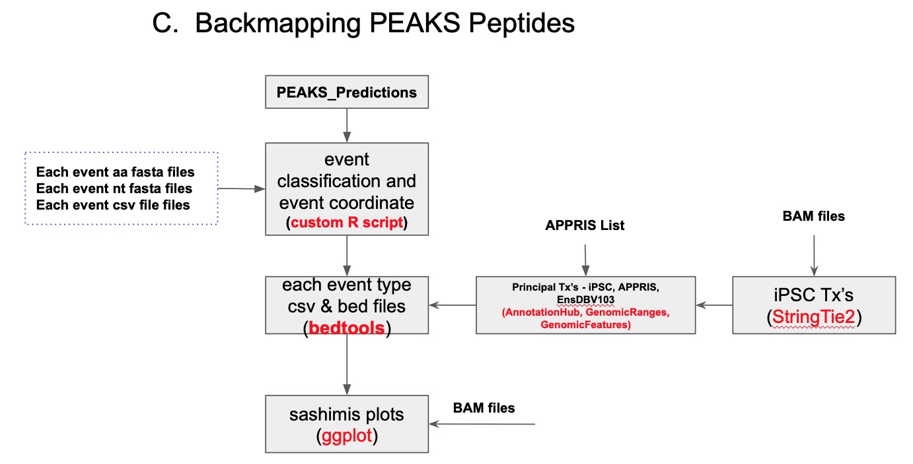

Proteogenomic Pipeline - C
(Mapping Peaks Results to event types)

Introduction: 
        PEAKS search provides a list of peptides identified as probable biomarkers. In order to identify which genomic regions (from splicing events) these peptides had originated, we have developed a set of bash and R scripts.

This pipeline relies on ggsashimi [1] tool with major modifications to suit our purpose and number of input files generated from Part A-B of protogenomic pipeline. Overall workflow for this part of the pipeline is shown in Figure 1.

Figure 1. General Workflow for Proteogenomic Pipeline - C

First input to this pipeline is a 63 column PEAKS_Results.csv with col1=Peptide and col60=Accession. After reading the Accession ID (which is a carefully formulated string (in Proteogenomic Pipeline A-B) of genomic coordinates, event number and frame of translation  in the respective csv file). Length of Accession ID for each event type is different and helps us differentiate between cryptic, skiptic and IR events. 

Peptide (type) classification (pgp-c_mapping.R)

After identifying each event type from Accession ID, pipeline then searches whether that event is present in the respective AA fast file and identifies positional coordinates (start and end) of string in the AA sequence to identify coordinates of the nt sequence and event number for that event. After identifying genomic coordinates, pipeline identifies whether this event belong to junction spanning region (upstream exon - ce or ce - down stream exon in the case of cryptics or upstream exon - downstream exon for the case of skiptics) or annotated/ce/IR regions (upstream exon, down stream exon, ce or IR regions). Several bed and csv files are created for each event category and are used to generate input files (get_UpDnEx_sashimiV1.sh) for ggsashimi.

Inputs: 

* PEAKS EVENTS csv file
   * 63 column csv file with col1=Peptide and col60=Accession
* Merged_aa_ce.fasta
   * AA fasta file containing FASTAID followed by AA seq for each of the events (fused upto 60 bp in up_stream, ce and upto 60 bp from downstream) from ce_inclusion, ce_extension and IR events. Please note that events in this file should follow ce_inclusion, ce and ce_extension with proper FASTAID format.
* Merged_igv_ce.csv
   * Original splicing events in each of these categories in the order as described above.
* Merged_nt_ce.fasta
   * Nt fasta file containing FASTAID and the order of events as described above.
* SKIPTICS_FUSED_AA1.fasta
   * AA fasta file for skiptics
* IGV_unique_skiptics_translated.csv
* Skiptics_fused_transeq_in.fasta
* IR_AA1.fasta, IGV_unique_IR.csv
* IR_coord_uniq_nt.transeq_in.fasta

Running script:

* Copy pgp_c.sh, pgp-c_get_UpDnEx_sashimiV1.sh, pgp-c_mappingV1.R and pgp-c_TxEnsDB103_layeredV4_PEAKS.R scripts in a folder (say PGP-C).
* Copy PEAKS_EVENTS.csv, Merged_aa_ce.fasta, Merged_igv_ce.csv, Merged_igv_ce.csv, Merged_nt_ce.fasta, SKIPTICS_FUSED_AA1.fasta, IGV_unique_skiptics_translated.csv, Skiptics_fused_transeq_in.fasta, IR_AA1.fasta, IGV_unique_IR.csv and IR_coord_uniq_nt.transeq_in.fasta files in inputs folder inside PGP-C folder.
* Copy (or create soft link to) Homo_sapiens.GRCh38.103.chr.sorted_new.gtf and GRCh38_appris_data.principal.txt files in the PGP-C folder.
* From the terminal (while being inside folder PGP-C) type: bash pgp_c.sh.
Execution times:
Pipeline is pretty fast (takes few minutes) for event type identification but creation of sashimi plots is most time consuming depending on:
* Total number of events in each category
* Genomic region to scan (this is usually a problem with IR events)
* Total replicates (BAM files)
For 25 BAM samples, 100 sashimi plots roughly takes 48 hours but is highly dependent on above mentioned factors.
Sample data: Yet to decide

Reference

1. Garrido-Martín, D., Palumbo, E., Guigó, R., & Breschi, A. (2018). ggsashimi: Sashimi plot revised for browser-and annotation-independent splicing visualization. PLoS computational biology, 14(8), e1006360.

